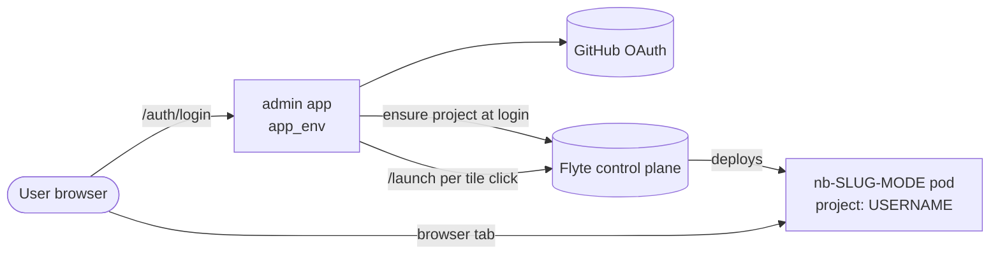
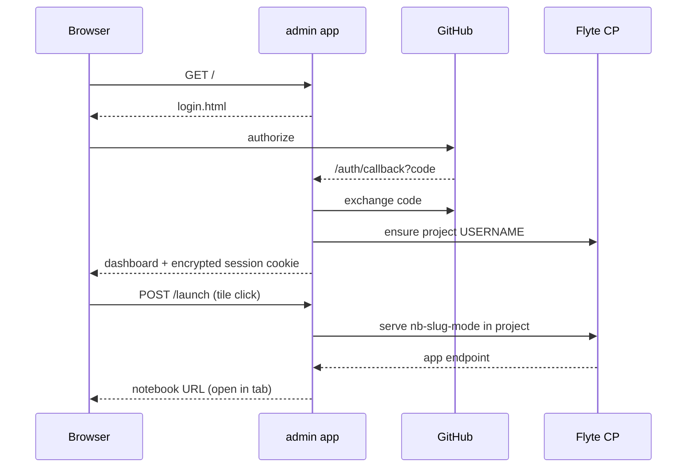

# App: Hosted Landing + Per-User Notebooks

The `app/` directory is **deployment glue** — FastAPI, OAuth, sessions, Flyte AppEnvironment definitions. It lives outside `src/stargazer/` because it is not invokable by tasks or workflows; the SDK stays importable in environments without FastAPI, OAuth secrets, or a Flyte control plane connection.

This doc is the high-level map of the hosting tier. For what the dashboard's notebook sections *mean* (taxonomy, archetypes, promotion paths), see [Notebooks](notebook.md). For implementation-level detail — the exact credential handshake, route table, pod-launch and sync mechanics — see the agent reference `.opencode/reference/architecture/app_internals.md`.

Two kinds of Flyte `AppEnvironment` are defined here:

- **`app_env`** (admin landing) — one shared instance, fronts GitHub OAuth and provisions per-user resources on first login.
- **Per-notebook envs** — built by the `per_notebook_env()` factory (`app/per_notebook.py`), one `nb-{slug}-{mode}` env per launch, deployed into the user's own Flyte project.

## Topology

One landing app, one per-notebook env factory, N notebook pods — one per launched (notebook, mode), isolated by per-user Flyte project. Login only ensures the project exists; pods are spawned lazily when a tile's Edit/Run button is clicked.

## Request Flow

If provisioning fails, the user lands on a provisioning page with a sign-out link as the escape hatch.

## Core Concepts

**Per-user isolation** is enforced by **Flyte project boundaries**, not by varying the env definition. `provision_user()` creates a project named after the sanitized GitHub username at login, and every per-notebook env is served into it; Flyte's per-project storage and cache isolation keeps user state separate. The factory is parameterized by notebook (slug, mode, path, fork, resources) — not by user — so who-you-are lives entirely in which project the env lands in.

**Workspace saving is opt-in.** Login creates the Flyte project but writes nothing to GitHub. A user who wants to author and persist notebooks enables saving, which forks the upstream repo into their account and installs a fork-scoped GitHub App. Until then, Tutorials and Workflows notebooks still run (from the image, no fork needed); Workspace and Snapshots stay empty.

**The security posture is "the broad credential never touches user code."** A short-lived OAuth token does the one-time fork, then is dropped; all later GitHub operations use a fork-scoped GitHub App installation token (~1h, minted on demand). Notebook pods never receive any GitHub credential — only a signed capability they exchange for a fresh fork-scoped token at clone/push time. The session cookie is encrypted. Full handshake and token-lifetime table in `.opencode/reference/architecture/app_internals.md`.

**Notebooks persist on the fork's `main`** — no side branch. The launch pod clones `main`, edits sync back to `main` on Save and on pod shutdown, and the dashboard lists from `main`. Upstream conflicts are avoided by path discipline (only `notebooks/workspace/` is ever committed) rather than branch isolation. Execution is unaffected by fork drift: the SDK comes from the image (`/stargazer`), not the checkout.

**Resources live in the notebook.** A workspace notebook's `[tool.stargazer]` header (cpu/memory) is parsed textually at launch — no code execution — and honored as-authored, no ceiling. Image-baked notebooks carry no header and fall back to the env default.

**Tiles are stateful and authoritative.** On load the dashboard asks the control plane which `nb-{slug}-{mode}` apps are live and hydrates those tiles to Open/Stop; a notebook runs in edit *or* run mode, never both. This is read from Flyte rather than in-memory state, so it survives admin restarts.

## Snapshots

A **snapshot** is a frozen notebook — a researcher takes an analysis to a publication-ready state and pins it as a read-only, reproducible record. Freezing **moves** the notebook out of the editable Workspace into `notebooks/snapshots/` on the fork; it can then be PR'd upstream, where it merges and reaches every other fork on sync.

This is deliberately the opposite of a **workflow**: workflows are off-the-shelf pipelines run again and again against new data; a snapshot is a single point-in-time record, valued precisely because it does not change. What's frozen is the notebook *source* — the auditable record of exactly what was run. The dashboard gives them separate sections — see [Notebooks → Promotion Paths](notebook.md#promotion-paths) for when to freeze versus graduate, and `.opencode/reference/architecture/app_internals.md` for the freeze/listing/launch mechanics.

## Asset Manager

The admin app also hosts `/assets` — a browse-and-upload surface over the
asset/metadata system, backed by Pinata (never the local TinyDB; the page
renders a "not configured" state without `PINATA_JWT`). Routes live in
`app/assets.py`; mechanics and the route table are in `.opencode/reference/architecture/app_internals.md`.

**Uploads never transit the admin pod.** The page validates metadata and
mints a Pinata **signed upload URL** (`POST /assets/sign`); the browser then
PUTs bytes straight to Pinata. Because Pinata bakes the filename and
keyvalues into the URL at mint time, the uploader can supply bytes only —
never metadata the server didn't validate. Validation is the *same*
`build_asset()` choke point the MCP server uses, so the page and the SDK
agree on what a valid upload is. Downloads redirect the same way: bytes go
browser↔Pinata, not through the pod.

**Ownership is server-stamped attribution, not enforcement.** Every hosted
write path stamps an `_owner` keyvalue — the page from the session at sign
time, workspace SDK/MCP uploads from a launcher-injected `STARGAZER_OWNER`,
pipeline outputs from that var forwarded into task pods. Users never type
it (`_`-prefixed keys are a reserved namespace `build_asset()` rejects). So
an unowned record on the hosted deployment is legacy data or a bug, never
expected. Because the Pinata JWT is shared, this is attribution only — it
drives default filtering, not access control; anyone with SDK/MCP access
can still read or delete anything. See [Types → Ownership](types.md#ownership-_owner).

**Two networks, two visibility rules.** The browse panel has Public and
Private tabs mapping to Pinata's two networks:

- **Private** fails closed — the server returns only records whose `_owner`
  matches the session user (the `_owner` filter is forced server-side, never
  trusted from the query string). Unowned or other-owned private records are
  invisible on the page, reachable only via SDK/MCP.
- **Public** is **anonymous** — public-network bytes are world-readable on
  IPFS, so gating the index behind a login was security theater. The listing
  is served from a short in-process TTL cache (a semi-static mirror, not a
  per-request proxy to the Pinata API), and anonymous downloads redirect to
  a free public gateway so they never spend metered dedicated-gateway
  bandwidth. `_owner` is stamped on public uploads too, as a publisher
  byline. Rate limiting of the anonymous surface is deferred.

**The page lives in the dashboard's box.** `assets.html` renders in the same
glassy card as the notebook dashboard (reached from the avatar menu's
**Assets** link), and the reactive starfield background is left untouched —
the asset graph is a separate foreground SVG. The browse surface offers two
interchangeable renderings of the same listing, switched by a Graph/List
toggle (Graph is the default):

- **Graph** draws assets as nodes and their `*_cid` provenance links
  (`reference_cid`, `mate_cid`, `alignment_cid`, …) as edges — a foreground
  constellation echoing the background field. Hovering a node peeks its
  metadata; clicking pins a detail card with the full metadata, its linked
  assets, and a download button. Links to assets outside the current view
  (cross-network or owner-scoped-out) aren't drawn but are listed on the card,
  so provenance is never hidden. It is dependency-free (a small static force
  layout, capped past 150 nodes), consistent with the rest of the app shipping
  only hand-written client JS. On a record the session user owns, the card also
  offers **Edit metadata** — an in-place fix for a mis-tagged record that
  merges the change (the CID is unchanged, so provenance edges survive). The
  edit route fail-closes on ownership server-side; the same fix is available
  via the MCP `update_file` tool.
- **List** is the same records as a sortable table (CID, name, owner, type,
  metadata, download). The upload panel below is schema-driven — pick a
  registered type or a bare/custom asset, fill metadata, choose the network —
  and uploads go browser→Pinata via the signed URL, appearing optimistically
  before Pinata's listing catches up.

## Images

The admin app and the per-notebook pods use **different images by design**:

- `app_env.image` is Flyte-built via `with_uv_project` — the admin is small Python with no heavy deps.
- Per-notebook envs use the programmatically-defined `notebook-app` image, referenced by a stable tag so the admin pod (no Docker daemon) never rebuilds it. The deploy entrypoint builds and publishes it before serving.

Note the `note` target in the project `Dockerfile` (`stargazer-note`) is a separate, local-`docker run`-only image — **not** the hosted one. Build/publish detail in `.opencode/reference/architecture/app_internals.md`.
