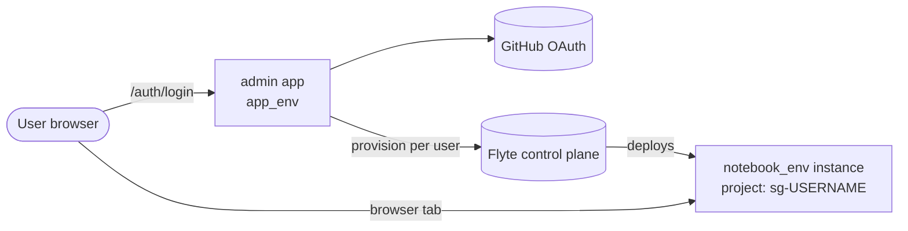
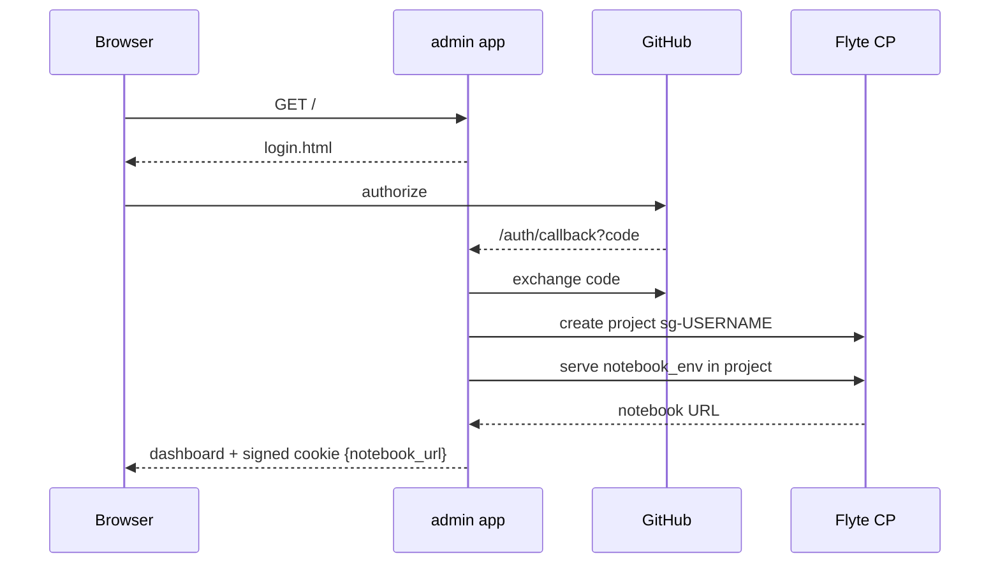

# App: Hosted Landing + Per-User Notebooks

The `app/` directory is **deployment glue** — FastAPI, OAuth, sessions, Flyte AppEnvironment definitions. It lives outside `src/stargazer/` because it is not invokable by tasks or workflows; the SDK stays importable in environments without FastAPI, OAuth secrets, or a Flyte control plane connection.

Two Flyte `AppEnvironment`s are defined here:

- **`app_env`** (admin landing) — one shared instance, fronts GitHub OAuth and provisions per-user resources on first login.
- **`notebook_env`** (notebook) — one definition, deployed once per user into the user's own Flyte project.

## Topology

One landing app, one notebook definition, N notebook deployments — one per user, isolated by Flyte project.

## Request Flow

If provisioning fails, the user lands on a provisioning page with a sign-out link as the escape hatch.

## Per-User Isolation

Per-user state is enforced by **Flyte project boundaries**, not by varying the env definition. `notebook_env` is a single, immutable `AppEnvironment`; `provision_user()` creates a project `sg-<sanitized-username>` and deploys that same env into it. Flyte's per-project storage and cache isolation keeps user state separate.

This is why `notebook_app` is not a factory function — nothing per-user lives in the env definition.

## Modules

| Module | Role |
|--------|------|
| `app/admin_app.py` | `app_env` + FastAPI routes (`/`, `/auth/login`, `/auth/callback`, `/auth/logout`, `/health`). Lifespan runs `init()` at startup. |
| `app/notebook_app.py` | `notebook_env` — marimo edit on the bundled scRNA tutorial. |
| `app/provision.py` | `provision_user()` — creates the Flyte project and serves `notebook_env` into it via `with_servecontext`. |
| `app/oauth.py` | GitHub OAuth helpers. |
| `app/session.py` | Signed-cookie session (`itsdangerous`). The cookie is the session — no server-side store. |
| `app/templates.py` + `templates/*.html` | `string.Template` HTML loader. |
| `app/init.py` | Runtime-context-aware Flyte init. |

## Runtime Init

The same `init()` works locally and in-cluster:

| Context | Signal | Call |
|---------|--------|------|
| In-cluster app pod | `_U_EP_OVERRIDE` set | `flyte.init_in_cluster()` |
| API-key context | `FLYTE_API_KEY` set | `flyte.init_from_api_key(...)` |
| Local dev / deployer | neither set | `flyte.init_from_config()` |

FastAPI's lifespan calls `init()` once at startup so subsequent SDK calls have a configured client.

## Images

The admin app and the notebook share a strict split:

- `app_env.image` is Flyte-built via `with_uv_project` — the admin is small Python with no heavy deps, and the Flyte builder is the natural fit.
- `notebook_env.image` is the pre-built `stargazer-note:latest` (the `note` target in the project `Dockerfile`). Referenced by string so Flyte does not try to (re)build it inside the admin pod — the admin pod has no Docker daemon and no project source layout, so the build would fail.

The admin deploy entrypoint (`python -m app.admin_app` / `stargazer-app`) runs `docker build --target note` and `docker push` for `stargazer-note:latest` before calling `flyte.serve(app_env)`, so the notebook image is always available in `STARGAZER_REGISTRY` when the admin pod first serves a per-user notebook.

## Open Issues

- **OAuth callback is synchronous.** `provision_user()` runs inline; a slow provision can outlive the browser's redirect window. Background provisioning + status polling is the planned fix.
- **Production auth.** `notebook_env.requires_auth=False` is a devbox concession. Production needs auth gated by the user's identity.
