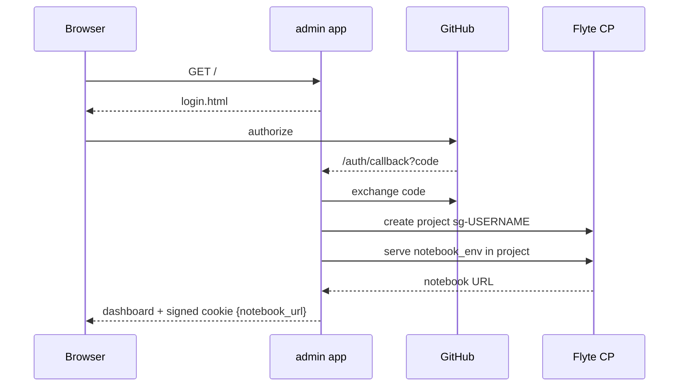

# App: Hosted Landing + Per-User Notebooks

The `app/` directory is **deployment glue** — FastAPI, OAuth, sessions, Flyte AppEnvironment definitions. It lives outside `src/stargazer/` because it is not invokable by tasks or workflows; the SDK stays importable in environments without FastAPI, OAuth secrets, or a Flyte control plane connection.

Two Flyte `AppEnvironment`s are defined here:

- **`app_env`** (admin landing) — one shared instance, fronts GitHub OAuth and provisions per-user resources on first login.
- **`notebook_env`** (notebook) — one definition, deployed once per user into the user's own Flyte project.

## Topology

One landing app, one notebook definition, N notebook deployments — one per user, isolated by Flyte project.

## Request Flow

If provisioning fails, the user lands on a provisioning page with a sign-out link as the escape hatch.

## Per-User Isolation

Per-user state is enforced by **Flyte project boundaries**, not by varying the env definition. `notebook_env` is a single, immutable `AppEnvironment`; `provision_user()` creates a project `sg-<sanitized-username>` and deploys that same env into it. Flyte's per-project storage and cache isolation keeps user state separate.

This is why `notebook_app` is not a factory function — nothing per-user lives in the env definition.

## Workspace Opt-In

Forking a user's GitHub account is **opt-in**, not automatic. Login creates the user's Flyte project but writes nothing to GitHub; `SessionData.fork_owner` stays empty (`SessionData.workspace_enabled` is False). Tutorials and Community notebooks run from the image and need no fork.

Opt-in is **two steps**, and `SessionData.workspace_enabled` requires both — gated on `fork_full_name` **and** `app_installed`. The Workspace section renders a disclaimer + an **Enable workspace saving** button. `POST /workspace/enable` forks the upstream repo, records `fork_full_name`, then redirects the user to install the GitHub App on the fork (see Credential Model). The App's setup-URL returns to `/auth/app-install-callback`, which sets `app_installed` (and drops the OAuth token) — only *then* is saving on. A user who forks but abandons the install is **not** shown as enabled (post-fork ops would fail), and a returning user's install is re-confirmed at login via `installation_tokens.get_installation_id`. Only when enabled does the section list the user's notebooks and `/launch` permit workspace launches (clone-on-start + push-on-sync against the fork's `main`). The `public_repo` OAuth scope is still requested at login, but no fork is created until this explicit action.

## Credential Model

Two GitHub identities, deliberately split so the broad credential is short-lived and never touches code the user controls:

| Step | Credential | Scope | Lifetime | Where it lives |
|---|---|---|---|---|
| Login + the one-time fork | **OAuth user token** (`read:user public_repo`) | all public repos | login → opt-in only | admin process + encrypted cookie, then **dropped** at install callback |
| Admin-side reads/writes (list/get/create/delete on the fork) | **GitHub App installation token** | the fork only | ~1h, minted on demand | admin process memory |
| Pod clone / push | **GitHub App installation token** via `GIT_ASKPASS` | the fork only | ~1h, minted at use | never persisted — fetched per operation |

The **GitHub App private key** is the trust anchor: held solely by the admin, it mints fork-scoped installation tokens (`app/installation_tokens.py`) for every post-fork operation. The OAuth token forks once at `/workspace/enable`; the App's install setup-URL hits `/auth/app-install-callback`, which clears the token from the session — so an *enabled* session carries no GitHub credential. A returning user whose fork already exists never stores the OAuth token at all.

**Pods never receive a GitHub credential.** `per_notebook_env` injects only a signed *capability* (`SG_POD_TOKEN`, carrying the fork name, not a token). At clone (`launch-notebook.sh`) and push (`proxy.py`), the pod exchanges that capability at the admin's `POST /workspace/pod-token` for a fresh fork-scoped token, fed to git via `GIT_ASKPASS` against a token-free remote — so nothing lands in `.git/config` or `os.environ`. The worst a malicious cell can do is mint a fork-scoped, ~1h, revocable token (uninstalling the App cuts it off) — never the broad OAuth token. The session cookie is **encrypted** (Fernet, keyed off `SESSION_SECRET`; the proxy mirrors the derivation), so even its identity fields are opaque client-side.

## Creating Notebooks & Per-Notebook Resources

Once opted in, the Workspace section offers a **New notebook** create tile (name + blank|template seed only — resources and the tile blurb are set afterward, see below). The seeds are real shipped notebooks — `notebooks/workspace/blank.py` and `template.py` — not generated source. `POST /workspace/create` slugifies the name, copies the chosen seed, injects **default** resources into its `[tool.stargazer]` header (`with_stargazer_resources`), writes it to the fork's `main` under `notebooks/workspace/`, and **returns the rendered tile HTML**. (Notebooks don't pin marimo in their PEP 723 headers — `marimo --sandbox` injects the image launcher's version into each kernel venv, so the two never skew without any per-notebook bookkeeping.) Create is a pure "add a notebook" action: the browser drops that tile into the Workspace grid and it behaves like every other tile (Edit/Run → launch → Open/Stop) — it does not launch or navigate. Both seed slugs are reserved create names and filtered out of the dashboard's tile listing.

Each Workspace tile carries two corner controls. A **gear** opens the settings modal to edit the notebook's **resources (cpu/memory)** and **description**; Save (`POST /workspace/settings`, workspace-only) rewrites the `[tool.stargazer]` header on the fork (`with_stargazer_resources(..., description=…)` via `update_workspace_notebook`, which carries the blob `sha`) and echoes the normalized values so the browser refreshes the tile blurb + the gear's `data-*` in place. Resource changes take effect at the **next** launch (resources bind at pod-spawn); the description updates immediately. The gear seeds its fields from `data-*` the dashboard renders by fetching each workspace notebook's header (in parallel, best-effort) at page load. A **trash** button (`POST /workspace/delete`, workspace-only) removes `<slug>.py` from the fork's `main` (idempotent — a file already gone still succeeds; git history keeps it recoverable) and best-effort deactivates any running edit/run pod for that slug, so deleting can't orphan a pod with no tile left to Stop it. Seed slugs are rejected by both. The browser confirms delete, then drops the tile on success.

## Running State (stateful tiles)

Tile run-state is unified and authoritative. The dashboard's launch/stop handlers are **event-delegated**, so dynamically added tiles (a freshly created notebook) work with no re-binding. On load the page calls **`GET /launch/status`**, which queries Flyte (`App.get` per candidate `nb-{slug}-{mode}` in the user's project, in parallel) and returns the active ones with their endpoints; the page flips those tiles straight to **Open + Stop** instead of a fresh Edit/Run. Because it reads the control plane rather than in-memory state, it's correct across admin restarts. (`App.listall` can't be scoped to a per-user project, so per-candidate `App.get` is used.) The candidate-slug enumeration is shared with cleanup via `_candidate_slugs`.

**One modality at a time.** A notebook runs in either `edit` *or* `run` mode, never both — there's no use case for two live pods of the same notebook, and forbidding it caps pod count at one per notebook. So when a tile is launched (or hydrated as already-running), the dashboard hides **both** the launched mode's own Edit/Run button *and* the other mode's, leaving only that pod's controls: **Open: Edit Mode** / **Open: Run Mode** (the open link is labeled by mode), **Stop**, and **Save** for workspace tiles. **Stop** restores both buttons. This is a client-side affordance: it removes the second-pod path from the UI rather than enforcing mutual exclusion in the control plane.

A running **Workspace** tile also gets a **Save** button (`POST /workspace/save`): the admin resolves that one pod's `App.endpoint` and calls its `/__sg__/workspace/sync` (server-to-server, with the session cookie). It's per-notebook on purpose — each pod owns its own `/workspace` clone, so syncing one can't clobber another's edits. A global commit would race those copies. The call uses the app's public endpoint regardless of where the admin runs (in-cluster pod, local `uvicorn`, prod) — devbox is configured so that hostname resolves inside the cluster too (see `.opencode/reference/devbox_workarounds.md`).

A global **Clean up stopped apps** control (`POST /workspace/cleanup`) deletes (`App.delete`) the deployment records for every *deactivated* `nb-{slug}-{mode}` candidate — Stop deactivates an app but leaves the record; this removes them. Active/idle apps are left alone.

Resources live **in the notebook**. At `/launch`, the admin fetches a workspace notebook's source from the fork and `app.notebook_meta.parse_notebook_resources` reads `[tool.stargazer]` (cpu/memory) and passes it to `per_notebook_env(resources=…)`. Values are honored **as-authored — no ceiling**; you rightsize per-notebook for the target cluster. Parsing is purely textual — the admin never executes notebook code. Image-baked tutorials/workflows notebooks carry no such block and keep the env's legacy `("2Gi", "6Gi")` default.

## Working Branch

User notebooks live and persist on the fork's **`main`** — there is no side branch. The launch script clones `main`, the proxy's sync commits and pushes back to `main`, and the dashboard lists from `main`. Sync runs on two triggers: the explicit **Save** button, and **pod shutdown** — because `/workspace` is ephemeral, the proxy registers a FastAPI `lifespan` hook that flushes pending edits when Knative scales the pod to zero (uvicorn runs as PID 1 via the launch script's `exec`, so it receives the SIGTERM and runs the hook; a shell `trap` would not survive `exec`). Conflicts with upstream are avoided not by branch isolation but by **path discipline**: the proxy only ever `git add`s `src/stargazer/notebooks/workspace/`, and users create new-named notebooks rather than editing shipped files, so the fork's `main` and upstream touch disjoint paths. The one shared file, `template.py`, is copied (never edited in place) by the create flow. The fork is also not auto-synced from upstream, and the SDK that notebooks import comes from the per-notebook image (`/stargazer`), not the fork checkout — so a drifting `main` doesn't affect execution.

## Snapshots

A **snapshot** is a frozen notebook: a researcher takes an analysis to a publication-ready state, then pins its **inputs, outputs, and task image** so the exact run can be reproduced later. Snapshots are PR'd into the main repo, where anyone can inspect them — and re-run them if they choose — knowing the result is the one that was published.

This is deliberately distinct from **workflows**. Workflows are off-the-shelf pipelines, parameterized and meant to be run again and again by anyone against new data. A snapshot is the opposite: a single point-in-time record, frozen against *its* data and *its* image, valued precisely because it does not change. The dashboard gives them separate sections for this reason.

**Freezing is a move.** `POST /workspace/snapshot` takes a notebook *out* of the editable Workspace surface: it re-creates the notebook's current `main` source verbatim under `notebooks/snapshots/<slug>.py` (`create_snapshot_notebook`), then deletes the workspace original (`delete_workspace_notebook`). The snapshots write happens first, so a failed move leaves the notebook editable rather than lost. The source of truth is the fork's `main` — its last *saved* state — so Save before snapshotting to capture live pod edits. Like delete, snapshot tears down any running pod for the slug (`_teardown_notebook_pods`), since once moved there's no Workspace tile left to Stop it.

Each Workspace tile carries a **📸 snapshot** button (between the gear and trash) that calls this route, then drops the workspace tile and inserts the returned tile into the Snapshots grid. The Snapshots section lists the fork's `notebooks/snapshots/` (`list_snapshots` → `_resolve_snapshot_files`, GitHub-only for the listing — no pod *lists* snapshots). A snapshot tile carries **a single Run button** — no Edit, gear, or trash, since a frozen record isn't edited or re-configured. Launching one goes through the same `/launch` path as workspace notebooks: `section=snapshots` is fork-backed (so it requires opt-in) and **restricted to run mode** (`marimo run`, read-only); the file is read from `SNAPSHOT_NOTEBOOK_DIR` (the snapshots dir in the pod's sparse clone, which already covers `src/stargazer/`) and its `[tool.stargazer]` resources are honored like any workspace launch. Snapshot slugs join `_candidate_slugs`, so a running snapshot hydrates to Open/Stop on reload and `/workspace/cleanup` reaps its stopped pod.

**Public vs. own — both flow through the fork.** Snapshots are not user-specific in the way Workspace notebooks are. They live in the repo's `notebooks/snapshots/` and travel with the fork like any other repo content: when a user enables saving, the fork is a full copy of upstream, so it already carries every **public, merged** snapshot — just like the shipped tutorials. The user's own 📸 freezes land in that same dir, and syncing the fork with `main` pulls in newly-merged public ones. So `list_snapshots(fork)` returns both, run launches serve both from the fork clone, and there's no separate upstream-listing or upstream-clone path. (One consequence: freezing a notebook whose slug matches an existing public snapshot is refused by the no-overwrite create — pick a distinct name.) The trade-off is that snapshots are visible only once a fork exists (opt-in), unlike image-baked tutorials which everyone sees.

**Deferred:** image-digest pinning and an inputs/outputs (CID) manifest. This cut freezes the notebook *source*, which is auditable; bit-for-bit re-run is a later phase. The publication path — a user PRs a fork snapshot into upstream, where it merges and then reaches every other fork on sync — is the GitHub-native flow, not a Stargazer route.

## Modules

| Module | Role |
|--------|------|
| `app/admin_app.py` | `app_env` + FastAPI routes (`/`, `/auth/login`, `/auth/callback`, `/auth/logout`, `/workspace/enable`, `/auth/app-install-callback`, `/workspace/create`, `/workspace/delete`, `/launch`, `/launch/status`, `/stop`, `/workspace/save`, `/workspace/cleanup`, `/workspace/pod-token`, `/health`). `/workspace/enable` is the opt-in that forks the upstream repo, records the verified `fork_full_name`, and redirects to the GitHub App install; `/auth/app-install-callback` finishes opt-in and drops the OAuth token; `/workspace/create` writes a new notebook to the fork's `main` and returns the rendered tile; `/workspace/settings` rewrites a workspace notebook's `[tool.stargazer]` header (resources + description); `/workspace/delete` removes a workspace notebook (idempotent) and deactivates any running pod for it; `/workspace/snapshot` *moves* a workspace notebook into `notebooks/snapshots/` (frozen) and tears down its pods; `/launch` serves a per-notebook env (workspace launches require opt-in); `/launch/status` reports active per-notebook apps so the dashboard hydrates running tiles to Open/Stop; `/stop` deactivates by name; `/workspace/save` syncs one running pod's workspace to the fork; `/workspace/cleanup` deletes deactivated per-notebook app records; `/workspace/pod-token` mints a fork-scoped git token for a pod that presents its capability. Post-fork GitHub ops go through `app/installation_tokens.py` (installation tokens), not the OAuth token. Lifespan runs `init()` at startup. |
| `app/notebook_meta.py` | Static parsing of a notebook's PEP 723 `[tool.stargazer]` block — `parse_notebook_resources` (cpu/memory, no ceiling) and `parse_notebook_description` (the tile blurb), no code execution; plus `memory_to_gib` (quantity → GiB int for the modal) and the header-rewrite helper `with_stargazer_resources` (resources + optional description, used by create and `/workspace/settings`). |
| `app/notebook_app.py` | `notebook_env` — marimo edit on the bundled scRNA tutorial. |
| `app/provision.py` | `provision_user()` — creates the Flyte project and serves `notebook_env` into it via `with_servecontext`. |
| `app/oauth.py` | GitHub OAuth helpers (login + the one-time fork). |
| `app/installation_tokens.py` | GitHub App client — mints fork-scoped, ~1h installation tokens from the App private key for every post-fork op (`fork_token`). The trust anchor of the Credential Model. |
| `app/session.py` | Encrypted-cookie session (`Fernet`, keyed off `SESSION_SECRET`). The cookie is the session — no server-side store. Also signs/verifies pod capabilities (`sign_pod_capability`). |
| `app/templates.py` + `templates/*.html` | Jinja2 template loader (`base.html`, `login.html`, `dashboard.html`, `_tile.html`); auto-escaped, shared chrome via ``. Static assets (landing logo) served from `app/static/` at `/static`. |
| `app/init.py` | Runtime-context-aware Flyte init. |

## Runtime Init

The same `init()` works locally and in-cluster:

| Context | Signal | Call |
|---------|--------|------|
| In-cluster app pod | `_U_EP_OVERRIDE` set | `flyte.init_in_cluster()` |
| API-key context | `FLYTE_API_KEY` set | `flyte.init_from_api_key(...)` |
| Local dev / deployer | neither set | `flyte.init_from_config()` |

FastAPI's lifespan calls `init()` once at startup so subsequent SDK calls have a configured client.

## Images

The admin app and the notebook share a strict split:

- `app_env.image` is Flyte-built via `with_uv_project` — the admin is small Python with no heavy deps, and the Flyte builder is the natural fit.
- `notebook_env.image` is the pre-built `stargazer-note:latest` (the `note` target in the project `Dockerfile`). Referenced by string so Flyte does not try to (re)build it inside the admin pod — the admin pod has no Docker daemon and no project source layout, so the build would fail.

The admin deploy entrypoint (`python -m app.admin_app` / `stargazer-app`) runs `docker build --target note` and `docker push` for `stargazer-note:latest` before calling `flyte.serve(app_env)`, so the notebook image is always available in `STARGAZER_REGISTRY` when the admin pod first serves a per-user notebook.

## Open Issues

- **OAuth callback is synchronous.** `provision_user()` runs inline; a slow provision can outlive the browser's redirect window. Background provisioning + status polling is the planned fix.
- **Production auth.** `notebook_env.requires_auth=False` is a devbox concession. Production needs auth gated by the user's identity.
