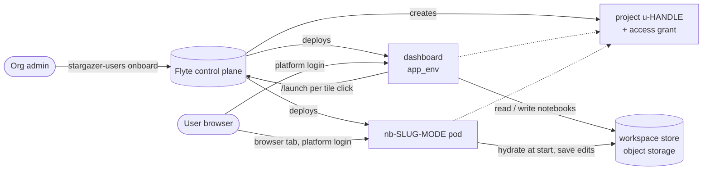
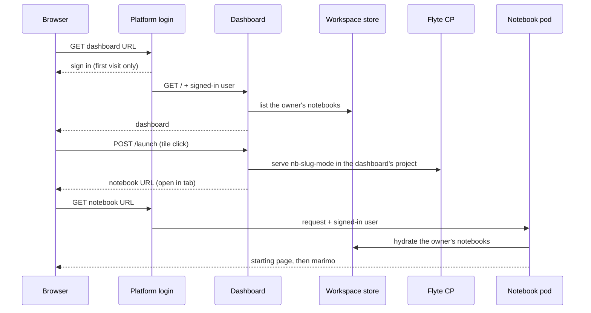

# App: Hosted Dashboard + Per-User Notebooks

The `app/` directory is **deployment glue**: FastAPI, Flyte AppEnvironment definitions, the workspace store. It lives outside `src/stargazer/` because it is not invokable by tasks or workflows; the SDK stays importable in environments without FastAPI or a Flyte control plane connection.

This doc is the high-level map of the hosting tier. For what the dashboard's notebook sections *mean* (taxonomy, archetypes, promotion paths), see [Notebooks](notebook.md). For implementation-level detail (identity headers, route table, pod launch, hydrate and sync mechanics), see the agent reference `.opencode/reference/architecture/app_internals.md`.

Two kinds of Flyte `AppEnvironment` are defined here, and both sit behind the platform's login (`requires_auth=True`):

- **`app_env`** (the dashboard) — one per user, deployed into that user's own Flyte project. Renders their notebooks, keeps them in the workspace store, and launches notebook apps. It is keyed to its owner, and the platform alone decides who may open it.
- **Per-notebook envs** — built by the `per_notebook_env()` factory (`app/per_notebook.py`), one `nb-{slug}-{mode}` env per launch, deployed into the same project and owned by the same user.

A third piece runs outside the platform: **onboarding** (`app/onboard.py`, the `stargazer-users` command), which an org admin runs from their own machine to give a user their project, access and dashboard.

## Topology

```mermaid
flowchart LR
    ADM([Org admin]) -->|stargazer-users onboard| FCP[(Flyte control plane)]
    FCP -->|creates| PR[project u-HANDLE<br/>+ access grant]
    FCP -->|deploys| D[dashboard<br/>app_env]
    U([User browser]) -->|platform login| D
    D -->|read / write notebooks| S[(workspace store<br/>object storage)]
    D -->|/launch per tile click| FCP
    FCP -->|deploys| N[nb-SLUG-MODE pod]
    U -->|browser tab, platform login| N
    N -->|hydrate at start, save edits| S
    D -.-> PR
    N -.-> PR
```

Each user has one project holding their dashboard and their notebook pods, and nothing else. Pods are spawned lazily when a tile's Edit/Run button is clicked. The dashboard never calls a pod: each pod loads and saves its owner's notebooks itself.

## Request Flow

```mermaid
sequenceDiagram
    participant B as Browser
    participant P as Platform login
    participant D as Dashboard
    participant S as Workspace store
    participant F as Flyte CP
    participant N as Notebook pod

    B->>P: GET dashboard URL
    P-->>B: sign in (first visit only)
    P->>D: GET / + signed-in user
    D->>S: list the owner's notebooks
    D-->>B: dashboard
    B->>D: POST /launch (tile click)
    D->>F: serve nb-slug-mode in the dashboard's project
    D-->>B: notebook URL (open in tab)
    B->>P: GET notebook URL
    P->>N: request + signed-in user
    N->>S: hydrate the owner's notebooks
    N-->>B: starting page, then marimo
```

## Core Concepts

**The platform owns sign-in.** There is no login page, OAuth flow or session cookie in the app tier. The platform gates every request to both app kinds and forwards the signed-in user's stable id (the *subject*) plus display claims. It overwrites any client-sent copy, so the identity can't be forged. The subject keys everything per-user: the workspace store prefix, the `_owner` stamped on assets, and the label that ties a user to their project.

**One project per user.** The platform admits a signed-in user to an app only if they can view the app's project, and anyone who can view a project sees every app in it. So each user gets their own project, `u-<handle>`, with access to that project and nothing else. Their dashboard and notebooks live there, and in the platform console they see only their own work. The project id is readable (from their email by default) and permanent; the subject on its label is what onboarding looks it up by.

**The platform is the only access control.** The app tier adds no ownership check of its own. Whoever the platform admits to a project (its user, or an org admin) can open that project's dashboard and notebooks. A dashboard knows its owner from its deploy and keys its state by that owner, not by the visitor, so an admin sees the owner's notebooks.

**Onboarding is an admin step.** New users need an invite to the org anyway, so the same command does the rest: invite (or find) the user, create their project, grant them access to it, and deploy their dashboard at a stable, bookmarkable address. Running it again only redeploys. Nothing that runs on the platform needs the right to create projects or grant access, and no privileged credential is deployed anywhere. Releasing a new version redeploys every user's dashboard from the same images; offboarding stops a user's apps, removes their access and archives their project, and leaves their notebooks in the store.

**Notebook pods are gated by the platform too.** Each pod is baked with its owner's subject, which only keys where it loads and saves notebooks. Platform cookies and identity headers are stripped before a request reaches the notebook, so notebook code never sees a visitor's platform token through a request.

**Per-user isolation** is enforced by **Flyte project boundaries**, not by varying the env definition. Every per-notebook env is served into the user's project, and Flyte's per-project storage and cache isolation keeps their runs separate. The factory is parameterized by notebook (slug, mode, path, resources) and owner, so which project the env lands in is what separates users.

**Saving just works.** A user's own notebooks live in the workspace store: object storage, one object per notebook, under the user's subject. There's no opt-in and no setup. The store is the durable copy and pods are working copies. A pod loads its owner's notebooks when it starts, writes changed notebooks back every few seconds, and does a final save when it scales to zero. Each pod writes only the notebooks it changed, so two running notebooks can't overwrite each other.

**Sharing upstream is a download.** Any workspace notebook or snapshot can be downloaded as its `.py` file and contributed to the repository like any other change. The app tier has no GitHub integration.

**Resources live in the notebook.** A workspace notebook's `[tool.stargazer]` header (cpu/memory) is parsed textually at launch (no code execution) and honored as-authored, with no ceiling. Image-baked notebooks carry no header and fall back to the env default.

**Tiles are stateful and authoritative.** On load the dashboard asks the control plane which `nb-{slug}-{mode}` apps are live and hydrates those tiles to Open/Stop; a notebook runs in edit *or* run mode, never both. Discovery is a single project-scoped deployment list, re-checked per app for authoritative status. This is read from Flyte rather than in-memory state, so it survives dashboard restarts.

**The tier is lightweight by construction.** Dashboard responses are gzip-compressed, and the notebook proxy streams everything except the HTML pages it decorates, so large notebook assets never sit in proxy memory. Details in `.opencode/reference/architecture/app_internals.md`.

## Snapshots

A **snapshot** is a frozen notebook: a researcher takes an analysis to a publication-ready state and pins it as a read-only, reproducible record. Freezing **moves** the notebook out of the editable Workspace into the user's snapshots in the workspace store. Published snapshots ship in the image, like tutorials, and appear in everyone's Snapshots section next to their own. Publishing one is a normal contribution: download it and add it to the repository's `notebooks/snapshots/`.

This is deliberately the opposite of a **workflow**: workflows are off-the-shelf pipelines run again and again against new data; a snapshot is a single point-in-time record, valued precisely because it does not change. What's frozen is the notebook *source*, the auditable record of exactly what was run. The dashboard gives them separate sections. See [Notebooks → Promotion Paths](notebook.md#promotion-paths) for when to freeze versus graduate, and `.opencode/reference/architecture/app_internals.md` for the freeze/listing/launch mechanics.

## Asset Index

Each dashboard also holds its user's **asset index**: the metadata behind `assemble()` for every file the user's tasks and notebooks store. It is a SQLite file on the dashboard's own disk. The user's notebook pods, and the task pods their runs start, reach it at the dashboard's in-cluster address (`http://dashboard.<project>-<domain>.svc.cluster.local`), which needs no login. The files themselves go straight to the bucket, under the same root as the user's notebooks; only one small row per asset passes through the dashboard.

The dashboard can scale to zero, so its disk isn't durable. Litestream copies every change to the bucket, at `<root>/users/<subject>/index`. At startup the dashboard restores the file before serving; at scale-to-zero it syncs one last time after the web server stops. Redeploying a dashboard briefly runs the old and new versions side by side, and a write the old one accepts after the new one has restored would be lost, so `stargazer-users upgrade` refuses while a user has runs going.

See [Configuration](configuration.md) for the storage model and `.opencode/reference/architecture/app_internals.md` for the mechanics.

## Asset Manager

The dashboard also hosts `/assets` — a browse-and-upload surface over the
asset/metadata system, backed by Pinata directly (not the storage index). **It is off
on hosted dashboards for now**: a user can read their own dashboard's
deployment, so a shared asset-store key can't be baked into it, and the page
says asset storage isn't available yet. It returns with per-user storage.
What follows describes the surface as it works when a key is configured
(locally, for example). Routes live in `app/assets.py`; mechanics and the
route table are in `.opencode/reference/architecture/app_internals.md`.

**Uploads never transit the dashboard pod.** The page validates metadata and
mints a Pinata **signed upload URL** (`POST /assets/sign`); the browser then
PUTs bytes straight to Pinata. Because Pinata bakes the filename and
keyvalues into the URL at mint time, the uploader can supply bytes only —
never metadata the server didn't validate. Validation is the *same*
`build_asset()` choke point the MCP server uses, so the page and the SDK
agree on what a valid upload is. Downloads redirect the same way: bytes go
browser↔Pinata, not through the pod.

**Ownership is server-stamped attribution, not enforcement.** Every hosted
write path stamps an `_owner` keyvalue (the user's subject) — the page from the signed-in user at sign
time, workspace SDK/MCP uploads from a launcher-injected `STARGAZER_OWNER`,
pipeline outputs from that var forwarded into task pods. Users never type
it (`_`-prefixed keys are a reserved namespace `build_asset()` rejects). So
an unowned record on the hosted deployment is legacy data or a bug, never
expected. Because the Pinata JWT is shared, this is attribution only — it
drives default filtering, not access control; anyone with SDK/MCP access
can still read or delete anything. See [Types → Ownership](types.md#ownership-_owner).

**Two networks, two visibility rules.** The browse panel has Public and
Private tabs mapping to Pinata's two networks:

- **Private** fails closed — the server returns only records whose `_owner`
  matches the signed-in user (the `_owner` filter is forced server-side, never
  trusted from the query string). Unowned or other-owned private records are
  invisible on the page, reachable only via SDK/MCP.
- **Public** needs no ownership — public-network bytes are world-readable on
  IPFS. A local run serves the public tab anonymously. The listing
  is served from a short in-process TTL cache (a semi-static mirror, not a
  per-request proxy to the Pinata API), and anonymous downloads redirect to
  a free public gateway so they never spend metered dedicated-gateway
  bandwidth. `_owner` is stamped on public uploads too, as a publisher
  byline. Rate limiting of the anonymous surface is deferred.

**The page lives in the dashboard's box.** `assets.html` renders in the same
glassy card as the notebook dashboard (reached from the avatar menu's
**Assets** link), and the reactive starfield background is left untouched —
the asset graph is a separate foreground canvas. The browse surface offers two
interchangeable renderings of the same listing, switched by a Graph/List
toggle (Graph is the default):

- **Graph** draws assets as nodes and their `*_cid` provenance links
  (`reference_cid`, `mate_cid`, `alignment_cid`, …) as edges — a foreground
  constellation echoing the background field. Hovering a node peeks its
  metadata; clicking pins a detail card with the full metadata, its linked
  assets, and a download button. It's rendered with **Cytoscape.js** (vendored,
  no build step), so it's interactive: scroll to zoom, drag to pan, drag a node
  to reposition it, double-click to reset, capped at 150 nodes. Links to assets
  outside the current view (cross-network or owner-scoped-out) aren't drawn but
  are listed on the card, so provenance is never hidden. On a record the signed-in user owns, the card also
  offers **Edit metadata** — an in-place fix for a mis-tagged record that
  merges the change (the CID is unchanged, so provenance edges survive). The
  edit route fail-closes on ownership server-side; the same fix is available
  via the MCP `update_file` tool.
- **List** is the same records as a sortable table (CID, name, owner, type,
  metadata, download). The upload panel below is schema-driven — pick a
  registered type or a bare/custom asset, fill metadata, choose the network —
  and uploads go browser→Pinata via the signed URL, appearing optimistically
  before Pinata's listing catches up.

## Images

The dashboard and the per-notebook pods use **different images by design**:

- `app_env.image` is Flyte-built via `with_uv_project` — the dashboard is small Python with no heavy deps.
- Per-notebook envs use the programmatically-defined `notebook-app` image. Onboarding builds it and hands each dashboard the exact build, so every notebook pod runs the image that shipped with its dashboard and the dashboard pod (no Docker daemon) never rebuilds it.

Both images are content-hashed, so a release builds each once however many users it deploys, and every user's dashboard runs the same build.

## Deploy Targets

One switch, `STARGAZER_TARGET`, picks the backend: `devbox` (the default, a local cluster for lightweight testing) or `union` (the hosted tenant). The app tier is built around the platform's login, which the devbox doesn't have, so the devbox gets one dashboard for a stand-in user instead of per-user onboarding: enough to test the asset index, asset storage and the dashboard locally. The stand-in is honored only on the devbox. It selects the deployer's Flyte config and where images are pushed. The Flyte domain is set separately, so the same target can serve a development or a production deployment. The per-target table is in `.opencode/reference/architecture/app_internals.md`.

Note the `note` target in the project `Dockerfile` (`stargazer-note`) is a separate, local-`docker run`-only image — **not** the hosted one. Build/publish detail in `.opencode/reference/architecture/app_internals.md`.
