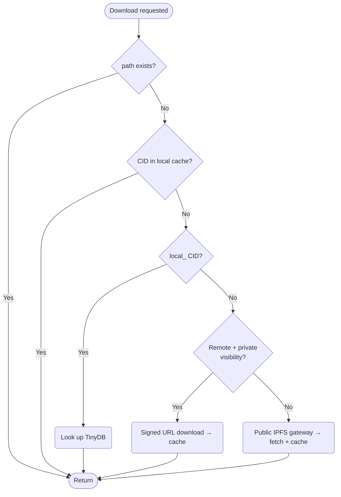
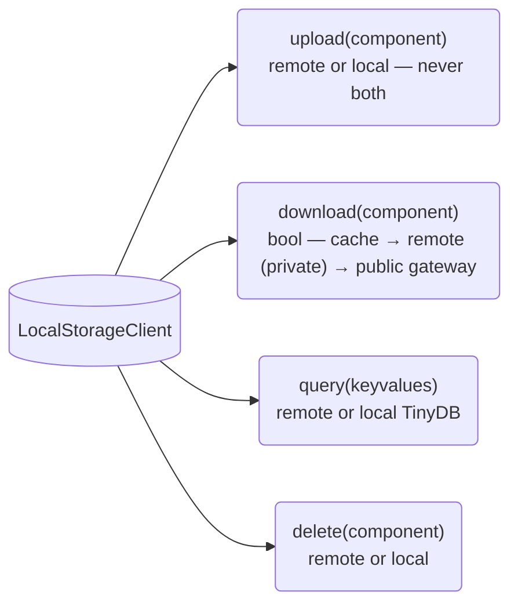
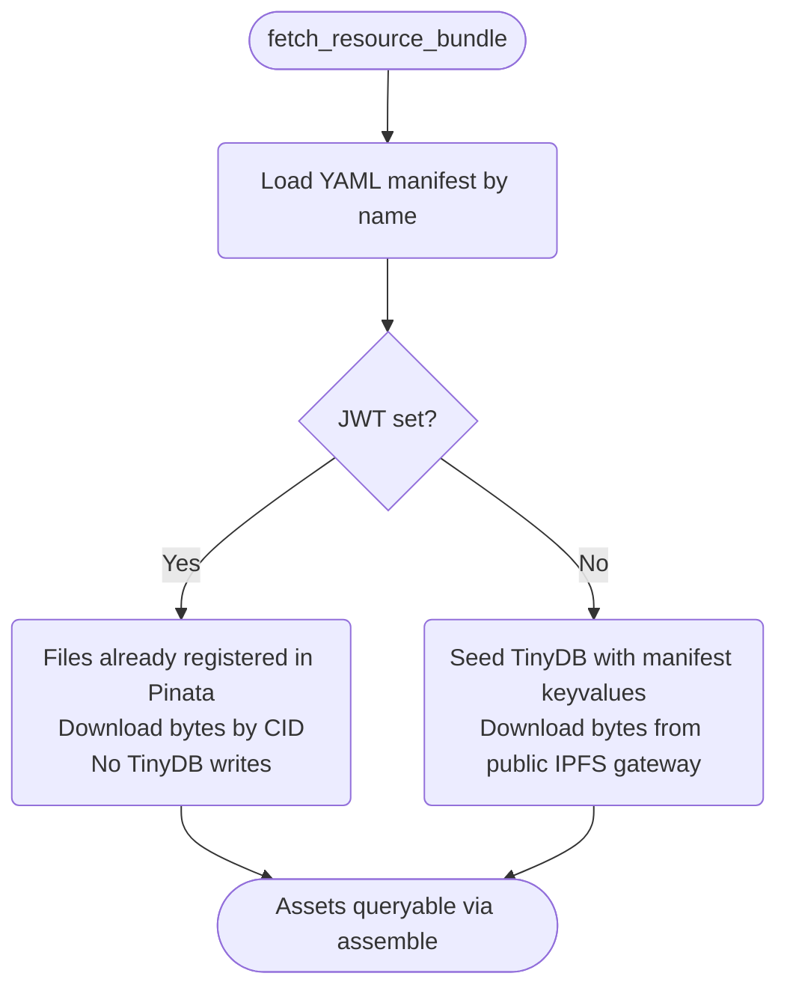

# Configuration

Stargazer uses `LocalStorageClient` as the single storage client. It always handles caching and local metadata. When `PINATA_JWT` is available, a `PinataClient` remote is attached for authenticated operations. Public IPFS gateway access is always available — downloading a public CID works out of the box with no configuration, the same way `docker run ubuntu` pulls from Docker Hub by default.

## Summary

| Setup | Download | Upload / Query / Delete | Env Requirements |
|-------|----------|------------------------|------------------|
| **Default** | Cache + public IPFS gateway | Local only (TinyDB) | None |
| **JWT + public** | Cache + public IPFS gateway | Pinata API (public network) | `PINATA_JWT`, `PINATA_VISIBILITY=public` |
| **JWT + private** | Cache + signed URLs | Pinata API (private network) | `PINATA_JWT` |

### Default (no JWT)

Files are stored on the local filesystem under `STARGAZER_LOCAL` (defaults to `~/.stargazer/local`). Metadata is indexed in a TinyDB database.

Downloads check the local cache first. On a cache miss, the public IPFS gateway is used to fetch the file — no credentials needed for public CIDs.

> **Note — public Pinata files require JWT to query:** Downloading a public CID works without credentials (any IPFS gateway can serve it), but *querying* Pinata's file index — even `/files/public` — requires a JWT. Without `PINATA_JWT`, `assemble()` searches only the local TinyDB; public files pinned to your Pinata account are invisible to it.

### With JWT

When `PINATA_JWT` is present, a `PinataClient` remote is attached. This enables upload, query, and delete via the Pinata API. `PINATA_VISIBILITY` controls whether files are uploaded to the public or private network:

- **private** (default): uploads as private, downloads use signed URLs, queries hit `/files/private`
- **public**: uploads as public, downloads use the public IPFS gateway, queries hit `/files/public`

> **Warning — ephemeral compute:** Without `PINATA_JWT`, uploads and metadata are stored only on the local filesystem. In ephemeral compute environments (e.g. Union/Flyte pods, CI runners, serverless functions), local storage is lost when the container exits. Set `PINATA_JWT` to persist outputs beyond the lifetime of the compute instance.

## Environment Variables

All env vars are centralized in `utils/config.py`. If set (even to empty string), the value is used exactly. If unset, the default applies.

| Variable | Purpose | Default | Required |
|----------|---------|---------|----------|
| `STARGAZER_LOCAL` | Local storage directory | `~/.stargazer/local` | No |
| `PINATA_JWT` | Pinata API authentication | None (unset) | Only for authenticated operations |
| `PINATA_GATEWAY` | Public IPFS gateway URL | `https://dweb.link` | No (set to empty string to disable) |
| `PINATA_VISIBILITY` | `public` or `private` | `private` | No |

## Resolution Logic

1. If `PINATA_JWT` is set: attach `PinataClient` remote
2. If no JWT: no remote (public gateway still available for downloads)

Always returns `LocalStorageClient`. The remote is optional.

## Download Flow

## Storage Client Protocol

All storage operations go through `LocalStorageClient`:

The two modes are explicit and separate:

- **JWT set (remote mode):** Pinata owns metadata and bytes. TinyDB is not involved. Upload, query, and delete go to Pinata. Downloads fetch bytes by CID via signed URL or public gateway, cached locally as bytes only.
- **No JWT (local mode):** TinyDB owns metadata. Local filesystem stores bytes. Downloads check TinyDB, then fall back to the public IPFS gateway for cache misses on bytes.

## Container Images

Stargazer ships four container images on `ghcr.io/stargazerbio`. They split along a sharp line: **task images** (run only by Flyte) are declared as `flyte.Image` / `flyte.Environment` in `src/stargazer/config.py`; **human-runnable images** (used via `docker run` and hosted via `flyte.serve`) are built from the project's multi-stage `Dockerfile`.

| Image | Source | Type | Where it runs |
|-------|--------|------|---------------|
| `stargazer-scrna` | `config.py` (`scrna_env`) | `flyte.TaskEnvironment` | scRNA-seq tasks (`tasks/scrna/`) |
| `stargazer-gatk` | `config.py` (`gatk_env`) | `flyte.TaskEnvironment` | GATK + alignment tasks (`tasks/gatk/`, `tasks/general/`) |
| `stargazer-note` | `Dockerfile` (`--target note`) | Marimo notebook | Local `docker run` exploration only |
| `stargazer-chat` | `Dockerfile` (`--target chat`) | Claude Code + OpenCode + MCP | Local `docker run` only |

Why the split: task images need nothing but Flyte's contract (an entrypoint Flyte injects, a content-hash tag Flyte pins by) — perfectly served by the SDK. Human-runnable images need a real `ENTRYPOINT`, baked-in source, and a stable `:latest` tag — none of which the Flyte Image SDK exposes. Rather than reinvent the Dockerfile via post-build wrapping, we just use a Dockerfile.

Hosted notebook pods use a separate image, **`notebook-app`**, defined programmatically in `app/per_notebook.py` and built/published by the admin deploy entrypoint — it is not `stargazer-note`. See [App → Images](app.md#images).

### Building locally

Contributor builds stay on the host. Nothing is pushed to a registry — no `docker login` needed, no write access to `ghcr.io/stargazerbio` required; CI publishes on merge to main. The Flyte task images build into the local docker cache (no `registry=` is set on the Flyte Images, so the docker builder falls through to `--load` instead of `--push`), with the builder selected in `.flyte/config.yaml` — `local` requires a working Docker daemon, `remote` (Union only) builds on the cluster. The human-runnable images build from the Dockerfile and are tagged with their published URLs even when local-only, so docker resolves them from the local cache by name. Commands in [Contributing → Building Images](../guides/contributing.md#building-images).

### Adding a tool

When a new Flyte task wraps a new CLI tool, layer it onto the image of the `TaskEnvironment` it is decorated against in `config.py` — via `with_apt_packages`, `with_commands`, or the bioconda install block. For tools that should be available in the human-runnable note/chat images, edit the bioconda block in the Dockerfile's `base` stage instead. See [Writing a Task](../guides/writing-a-task.md).

## Resource Bundles

Bundles are curated sets of files (reference genomes, demo datasets) defined as YAML manifests in `src/stargazer/bundles/`. Each manifest lists CIDs and their keyvalues, with a `bundle` keyvalue on each file for queryability.

### Hydration Flow

`fetch_resource_bundle(bundle_name)` downloads files by CID:

### Bundle Format

A manifest carries a `name`, a `description`, and a `files` list; each file entry is a `cid` plus its `keyvalues` (asset type, sample metadata, and the `bundle` tag). See the manifests in `src/stargazer/bundles/` for live examples.

After hydration, bundled assets are queryable via `assemble()` and `query_files` like any other asset.

