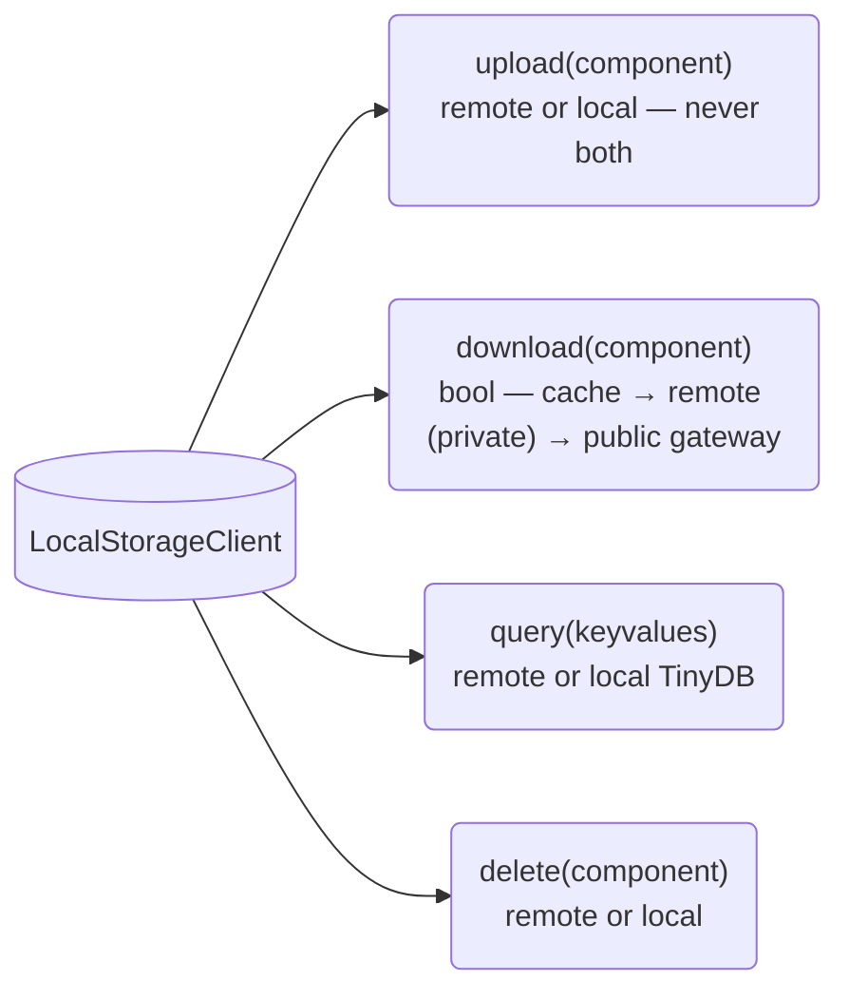

# Configuration

Stargazer uses `LocalStorageClient` as the single storage client. It always handles caching and local metadata. When `PINATA_JWT` is available, a `PinataClient` remote is attached for authenticated operations. Public IPFS gateway access is always available — downloading a public CID works out of the box with no configuration, the same way `docker run ubuntu` pulls from Docker Hub by default.

## Summary

| Setup | Download | Upload / Query / Delete | Env Requirements |
|-------|----------|------------------------|------------------|
| **Default** | Cache + public IPFS gateway | Local only (TinyDB) | None |
| **JWT + public** | Cache + public IPFS gateway | Pinata API (public network) | `PINATA_JWT`, `PINATA_VISIBILITY=public` |
| **JWT + private** | Cache + signed URLs | Pinata API (private network) | `PINATA_JWT` |

### Default (no JWT)

Files are stored on the local filesystem under `STARGAZER_LOCAL` (defaults to `~/.stargazer/local`). Metadata is indexed in a TinyDB database.

Downloads check the local cache first. On a cache miss, the public IPFS gateway is used to fetch the file — no credentials needed for public CIDs.

### With JWT

When `PINATA_JWT` is present, a `PinataClient` remote is attached. This enables upload, query, and delete via the Pinata API. `PINATA_VISIBILITY` controls whether files are uploaded to the public or private network:

- **private** (default): uploads as private, downloads use signed URLs, queries hit `/files/private`
- **public**: uploads as public, downloads use the public IPFS gateway, queries hit `/files/public`

> **Warning — ephemeral compute:** Without `PINATA_JWT`, uploads and metadata are stored only on the local filesystem. In ephemeral compute environments (e.g. Union/Flyte pods, CI runners, serverless functions), local storage is lost when the container exits. Set `PINATA_JWT` to persist outputs beyond the lifetime of the compute instance.

## Environment Variables

All env vars are centralized in `utils/config.py`. If set (even to empty string), the value is used exactly. If unset, the default applies.

| Variable | Purpose | Default | Required |
|----------|---------|---------|----------|
| `STARGAZER_LOCAL` | Local storage directory | `~/.stargazer/local` | No |
| `PINATA_JWT` | Pinata API authentication | None (unset) | Only for authenticated operations |
| `PINATA_GATEWAY` | Public IPFS gateway URL | `https://dweb.link` | No (set to empty string to disable) |
| `PINATA_VISIBILITY` | `public` or `private` | `private` | No |

## Resolution Logic

1. If `PINATA_JWT` is set: attach `PinataClient` remote
2. If no JWT: no remote (public gateway still available for downloads)

Always returns `LocalStorageClient`. The remote is optional.

## Download Flow


## Storage Client Protocol

All storage operations go through `LocalStorageClient`:



The two modes are explicit and separate:

- **JWT set (remote mode):** Pinata owns metadata and bytes. TinyDB is not involved. Upload, query, and delete go to Pinata. Downloads fetch bytes by CID via signed URL or public gateway, cached locally as bytes only.
- **No JWT (local mode):** TinyDB owns metadata. Local filesystem stores bytes. Downloads check TinyDB, then fall back to the public IPFS gateway for cache misses on bytes.

## Container Images

Every Stargazer container image is declared as a `flyte.Environment` in `src/stargazer/config.py`. There is no separate `Dockerfile` source of truth — the env definitions are authoritative. The `stargazer-build-images` console script (see `src/stargazer/build_images.py`) calls `flyte.build_images()` against each env in turn and pushes the result to whatever registry `.flyte/config.yaml` resolves.

| Env | Type | Image shape | Where it runs |
|-----|------|-------------|---------------|
| `scrna_env` | `TaskEnvironment` | Lean — debian base + scanpy | scRNA-seq tasks (`tasks/scrna/`) |
| `gatk_env` | `TaskEnvironment` | Lean — `broadinstitute/gatk` base | GATK + alignment tasks (`tasks/gatk/`, `tasks/general/`) |
| `note_env` | `AppEnvironment` | Heavy — debian + bioconda CLIs + full project deps via `with_uv_project(install_project)` | Marimo notebook server (`stargazer-app`) |
| `chat_env` | `TaskEnvironment` | Heavy — `note` payload + Node.js, Claude Code, OpenCode | Pre-wired agentic interface to the MCP server (end-user image; **not** a contributor dev shell) |

Lean envs ship only what each task family actually needs so cold-start stays fast. The two heavy envs replace what used to be the multi-stage `Dockerfile` (`note` and `chat` targets) and consolidate the marimo notebook image — there is now exactly one notebook image, declared alongside the task envs.

Source contributors install Stargazer natively (`uv sync --group dev` + a host-level `mamba install` for bioconda CLIs) — see [Contributing](../guides/contributing.md). The `chat` image carries no `dev` group and no shell extras; it is for end users driving the MCP server through an AI agent.

Shared image layers (mamba + bwa, bwa-mem2, samtools, gatk4) are factored into the module-private `_BIOCONDA_INSTALL` and `_BIOCONDA_PATH` constants so `note_env` and `chat_env` share the bioconda payload without copy-paste.

### Building and pushing

```bash
docker login <registry>     # required when image.builder = local
stargazer-build-images       # builds and pushes scrna, gatk, note, chat
```

Or per-env via the underlying CLI:

```bash
flyte build src/stargazer/config.py scrna_env
flyte build src/stargazer/config.py note_env
```

The builder is selected in `.flyte/config.yaml` — `local` requires a working Docker daemon, `remote` (Union only) builds on the cluster.

### Adding a tool

When a new task wraps a new CLI tool, layer it onto the `TaskEnvironment` it is decorated against in `config.py`:

```python
gatk_env = flyte.TaskEnvironment(
    ...
    image=flyte.Image.from_base("broadinstitute/gatk").with_apt_packages("my-new-tool"),
)
```

For bioconda installs that should appear in both heavy envs, extend the shared `_BIOCONDA_INSTALL` block.

## Resource Bundles

Bundles are curated sets of files (reference genomes, demo datasets) defined as YAML manifests in `src/stargazer/bundles/`. Each manifest lists CIDs and their keyvalues, with a `bundle` keyvalue on each file for queryability.

### Hydration Flow

`fetch_resource_bundle(bundle_name)` downloads files by CID:


### Bundle Format

```yaml
name: scrna_demo
description: Sample scRNA-seq mouse brain data for demo workflows
files:
  - cid: QmABC...
    keyvalues:
      asset: anndata
      bundle: scrna_demo
      sample_id: s1d1
      stage: raw
      organism: mouse
```

After hydration, bundled assets are queryable via `assemble()` and `query_files` like any other asset.

