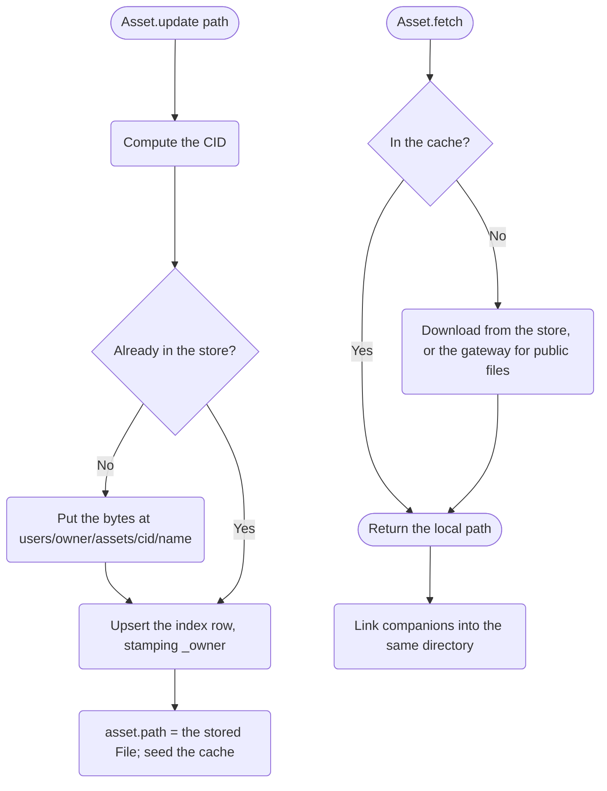

# Configuration

Asset storage has three parts: an **object store** for the bytes, an **index** for the metadata, and a **local cache** in front of both. A fourth, the **public tier**, holds shared data on Pinata's public network. The same code runs locally and on a hosted deploy; only the locations differ.

| Part | Locally | On Union | Set by |
|------|---------|----------|--------|
| Object store | `~/.stargazer/store` | The tenant bucket, under the deploy's root | `STARGAZER_STORE_ROOT` |
| Index | `~/.stargazer/index.db` (SQLite) | The user's dashboard, over HTTP | `STARGAZER_INDEX_URL` |
| Local cache | `~/.stargazer/local` | The pod's disk | `STARGAZER_LOCAL` |
| Public tier | Off without a key | Pinata's public network | `PINATA_JWT` |

## Identity and layout

An asset's identity is its **IPFS CID**, computed locally from the bytes with the same parameters Pinata uses, so a file's working CID is the CID it keeps if it's ever published. Each user's files are stored once, at `<store root>/users/<owner>/assets/<cid>/<name>`, where the owner is `STARGAZER_OWNER` (the Union subject) or `local`. An asset's `path` is a `flyte.io.File` naming that stored location, so an asset passed between tasks points somewhere every pod can read.

The index holds one row per CID: where the bytes live, the original filename, and the asset's keyvalues. Re-recording a CID with different keyvalues replaces them and logs a warning. Rows are written after the bytes, so a row never points at a missing file, and a write that doesn't land fails the task rather than being retried behind its back.

The cache keeps each downloaded file at `<STARGAZER_LOCAL>/<cid>/<name>`. Uploads seed it, so a task's outputs are already cached in the same pod or local run.

## Environment Variables

All env var defaults are set in `config.py`. If set (even to empty string), the value is used exactly. If unset, the default applies.

| Variable | Purpose | Default | Required |
|----------|---------|---------|----------|
| `STARGAZER_STORE_ROOT` | Object-store root: a directory or a bucket URI | `~/.stargazer/store` | No |
| `STARGAZER_INDEX_URL` | Index: a SQLite file path, or a dashboard URL | `~/.stargazer/index.db` | No |
| `STARGAZER_LOCAL` | Scratch space for task outputs, and the download cache | `~/.stargazer/local` | No |
| `STARGAZER_OWNER` | Owner of new assets: their folder in the store, and `_owner` | None (unset → `local`) | No |
| `PINATA_JWT` | Turns on the public tier | None (unset) | Only for public data |
| `PINATA_GATEWAY` | IPFS gateway for public downloads | `https://dweb.link` | No |
| `STARGAZER_TARGET` | Flyte backend for images and deploys: `devbox` or `union` | `devbox` | No |
| `STARGAZER_REGISTRY` | Image push registry | `localhost:30000` on `devbox`; unset on `union` (the builder's own registry) | No |

`STARGAZER_STORE_ROOT` and `STARGAZER_INDEX_URL` are forwarded into task pods only when set explicitly. A pod can't use the local default store or index, so a remote run submitted locally with the defaults has nowhere shared to write. Local-to-cluster storage is tracked on the roadmap.

## Writing and reading

```mermaid
flowchart TD
    U([Asset.update path]) --> C("Compute the CID")
    C --> S{Already in the store?}
    S -->|No| P("Put the bytes at users/owner/assets/cid/name") --> R
    S -->|Yes| R("Upsert the index row, stamping _owner")
    R --> F("asset.path = the stored File; seed the cache")

    G([Asset.fetch]) --> H{In the cache?}
    H -->|Yes| L([Return the local path])
    H -->|No| D("Download from the store, or the gateway for public files") --> L
    L --> M("Link companions into the same directory")
```

`fetch()` returns the local path. Companions — any asset recording `<asset_key>_cid` for this one, such as an index or dictionary — land in the same directory, where tools like GATK look for them. An asset built from a local file that was never stored is used in place. An asset known only by its CID is located through the index, then the public gateway.

Gateway downloads use aiohttp directly: `flyte.io.File.download()` can't read an `https://` path.

## Querying

`assemble(**filters)` asks the storage client for every record matching all the filters. Every key must match exactly; a list value matches any of its entries, in one query. With a Pinata key, Pinata's public records join the user's rows, deduplicated by CID, with the user's own row winning.

## The public tier

Shared data — bundles, reference genomes — is public data on Pinata's public network: anyone can read it, and `_owner` records who uploaded it. The SDK reads Pinata's public index (which needs `PINATA_JWT` even for public files) and downloads public bytes from `PINATA_GATEWAY`. It no longer uses Pinata's private network; the asset-manager page still calls Pinata directly on both networks.

### Pinata upload paths

`PinataClient.upload()` size-branches. Files up to 100MB use the plain
multipart POST (one round trip, CID in the response body). Larger files use
Pinata's resumable **TUS** endpoint — chunked `PATCH`es, CID read from the
`Upload-Cid` header on the completing request. The split is required, not an
optimization: Pinata's plain POST is hard-capped at 100MB. The TUS path is
chunked-first (no resume yet) with a 10 GiB/file ceiling — itself a Pinata
limit, not an IPFS one (IPFS chunks files into a DAG with no inherent size
cap).

`query(keyvalues, network=)` queries one network when `network` is given,
else merges both; each record carries the network it was found on.

`create_signed_upload_url(filename, keyvalues, network, ...)` mints a signed
URL with the filename and keyvalues fixed at mint time — used by the admin
asset page so a browser can upload bytes directly to Pinata without the
metadata ever passing through (or being chooseable at) the upload client.
`_owner` attribution and the size cap are baked in there too — see
[App → Asset Manager](app.md#asset-manager).

## Container Images

Stargazer ships four container images on `ghcr.io/stargazerbio`. They split along a sharp line: **task images** (run only by Flyte) are declared as `flyte.Image` / `flyte.Environment` in `src/stargazer/config.py`; **human-runnable images** (used via `docker run` and hosted via `flyte.serve`) are built from the project's multi-stage `Dockerfile`.

| Image | Source | Type | Where it runs |
|-------|--------|------|---------------|
| `stargazer-scrna` | `config.py` (`scrna_env`) | `flyte.TaskEnvironment` | scRNA-seq tasks (`tasks/scrna/`) |
| `stargazer-gatk` | `config.py` (`gatk_env`) | `flyte.TaskEnvironment` | GATK + alignment tasks (`tasks/gatk/`, `tasks/general/`) |
| `stargazer-note` | `Dockerfile` (`--target note`) | Marimo notebook | Local `docker run` exploration only |
| `stargazer-chat` | `Dockerfile` (`--target chat`) | Claude Code + OpenCode + MCP | Local `docker run` only |

Why the split: task images need nothing but Flyte's contract (an entrypoint Flyte injects, a content-hash tag Flyte pins by) — perfectly served by the SDK. Human-runnable images need a real `ENTRYPOINT`, baked-in source, and a stable `:latest` tag — none of which the Flyte Image SDK exposes. Rather than reinvent the Dockerfile via post-build wrapping, we just use a Dockerfile.

Both task images install the stargazer package itself, not only its dependencies. A task pod finds the tasks a workflow calls by their installed module names, so without the package a workflow's child tasks can't load, wherever the run was submitted from. Your own tasks and workflows still travel in each run's code bundle. Since the package is in the image, a change to the project's source builds new task images; `.dockerignore` is an allowlist of what images copy, so docs, tests and local caches don't.

Hosted notebook pods use a separate image, **`notebook-app`**, defined programmatically in `app/per_notebook.py` and built/published by the admin deploy entrypoint — it is not `stargazer-note`. See [App → Images](app.md#images).

### Building locally

Contributor builds stay on the host. Nothing is pushed to a registry — no `docker login` needed, no write access to `ghcr.io/stargazerbio` required; CI publishes on merge to main. The Flyte task images build into the local docker cache (no `registry=` is set on the Flyte Images, so the docker builder falls through to `--load` instead of `--push`), with the builder selected in `.flyte/config.yaml` — `local` requires a working Docker daemon, `remote` (Union only) builds on the cluster. The human-runnable images build from the Dockerfile and are tagged with their published URLs even when local-only, so docker resolves them from the local cache by name. Commands in [Contributing → Building Images](../guides/contributing.md#building-images).

### Adding a tool

When a new Flyte task wraps a new CLI tool, layer it onto the image of the `TaskEnvironment` it is decorated against in `config.py` — via `with_apt_packages`, `with_commands`, or the bioconda install block. For tools that should be available in the human-runnable note/chat images, edit the bioconda block in the Dockerfile's `base` stage instead. See [Writing a Task](../guides/writing-a-task.md).

## Resource Bundles

Bundles are curated sets of public files (reference genomes, demo datasets) defined as YAML manifests in `src/stargazer/bundles/`. Each manifest lists CIDs and their keyvalues, with a `bundle` keyvalue on each file for queryability.

### Fetching

`fetch_resource_bundle(bundle_name)` downloads each file by CID from the IPFS gateway into the local cache and registers it in the user's index, pointing at the gateway. A fetched bundle is then findable with `assemble()` whether or not a Pinata key is set; with one, the same files also come back through the public tier.

### Bundle Format

A manifest carries a `name`, a `description`, and a `files` list; each file entry is a `cid` plus its `keyvalues` (asset type, sample metadata, and the `bundle` tag). See the manifests in `src/stargazer/bundles/` for live examples.

After hydration, bundled assets are queryable via `assemble()` and `query_files` like any other asset.

