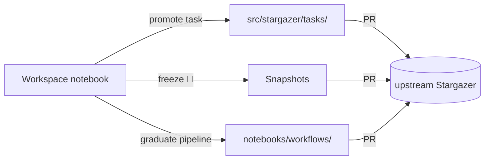
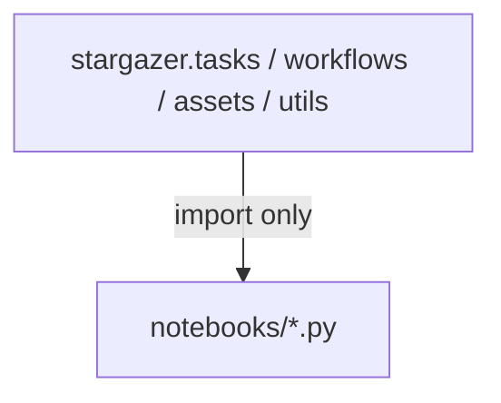

# Notebooks

The marimo notebook is Stargazer's primary user surface. Researchers often think in analyses — load data, run a pipeline, look at a plot — and the notebook gives them that experience while everything underneath stays reproducible: the tasks a notebook calls are the same typed, versioned, image-pinned SDK code that runs in production, and the execution context (local vs remote cluster) is a config concern, not a code change.

The SDK (`src/stargazer/` — assets, tasks, workflows) is a first-class surface in its own right: importing tasks and authoring workflows directly in an IDE is a perfectly legitimate way to work, and nothing about it is reserved for maintainers. Notebooks are simply the more approachable entry point — most users meet the SDK through them first. The two layers exist for each other:

- **The SDK exists so notebooks are trustworthy.** A notebook cell that calls `bwa_mem` or the scRNA pipeline is calling tested, resource-specified, container-pinned code — not a copy-pasted shell command.
- **Notebooks exist so the SDK gets used and grown.** They are where new analyses are prototyped, where new tasks are first written, and where finished work is published. Every promotion path below starts in a notebook and ends in the SDK or the repo.

This doc covers what notebooks *are* — the taxonomy, who uses them, and how work moves between notebooks and the SDK. The hosting machinery (dashboard, per-user forks, pods, credentials) is covered in [App](app.md).

## Execution Context

Where *tasks* run. Notebooks call `flyte.init_from_config()` at startup; `.flyte/config.yaml` determines whether tasks execute locally or on a remote cluster. This one config switch is what lets the same notebook span the whole arc: pointed at local execution it's an exploratory scratchpad, and pointed at a remote Flyte backend it's a production workflow management interface — launching, parameterizing, and tracking pipelines on a cluster — with no code changes between the two. The Execution tutorial demonstrates exactly this.

## Notebook Types

The dashboard renders four sections, matching four directories under `src/stargazer/notebooks/`:

| Type | Directory | Source of truth | Mode | Purpose |
|------|-----------|-----------------|------|---------|
| **Tutorials** | `tutorials/` | Image-baked (upstream repo) | Edit | Learn the building blocks — a reading sequence: Assets → Tasks → Workflows → Execution |
| **Workflows** | `workflows/` | Image-baked (upstream repo) | Edit or Run | Production pipelines, parameterized — bring your own data (e.g. the scRNA-seq pipeline) |
| **Workspace** | `workspace/` | User's GitHub fork | Edit or Run | The user's own notebooks — authored from scratch or a template, persisted across sessions |
| **Snapshots** | `snapshots/` | User's fork (own + merged public) | Run only | Frozen analyses — a saved notebook pinned for reproduction, never edited |

The first two ship in the image and work for everyone with no setup. The last two live on the user's fork and require the [workspace opt-in](app.md#core-concepts). The tile registry for image-shipped notebooks is `app/notebooks.py`; workspace and snapshot tiles are discovered from the fork at render time.

Tutorials and Workflows are both image-baked but differ in intent: a tutorial teaches a concept and is read once; a workflow notebook is an off-the-shelf pipeline meant to be run repeatedly against new data. Snapshots are the deliberate opposite of workflows — a single point-in-time record, frozen against *its* data and *its* image, valued precisely because it does not change.

## User Archetypes

Notebook types map onto a progression. Each rung uses everything below it:

1. **Analyst** — runs Workflow notebooks against their own data, with the Tutorials as the reference for the building blocks. The image provides everything; parameters and uploads happen in the notebook UI.
2. **Author** — opts into workspace saving, writes their own notebooks, and freezes finished analyses as Snapshots. Their work persists on their fork and can be PR'd upstream.
3. **Contributor** — promotes notebook-grown code into the SDK: tasks into `src/stargazer/tasks/`, proven pipelines into `notebooks/workflows/`. Works against the repo natively — see [Contributing](../guides/contributing.md).

Orthogonal to the ladder are **SDK-native users** (authoring workflows in an IDE by importing `stargazer` tasks directly), **agent users** (driving the MCP server from Claude Code, Cursor, etc.), and **maintainers** (curating the SDK, reviewing promotions, publishing images). The same person frequently occupies several rungs in one session — the point of the design is that moving up a rung never requires abandoning the notebook.

## Promotion Paths

Work flows from experimentation toward the SDK and the public repo along three paths, all starting in a Workspace notebook:

### Task promotion — notebook cell → SDK task

Researchers define tasks directly in notebook cells using proper Flyte conventions — `@gatk_env.task`, asset types, async signatures. These are real tasks that run against real data in the notebook.

1. **Author** in a notebook cell — proper decorators, structured I/O, async patterns. The task works in the notebook as-is.
2. **Promote** — mechanical extraction: strip the cell wrapper, move the function into the right `src/stargazer/tasks/` subdirectory, generate a skeleton test.
3. **Review** — a code-review agent picks up the PR and suggests changes to fit project conventions (docstrings, naming, test coverage). Convention enforcement happens at review time, not authoring time.

Researchers write a working task; promotion does the mechanical extraction; PR review adds the polish. Once a promoted task needs refinement beyond what review suggests, work continues natively against the repo like any other SDK change — see [Contributing](../guides/contributing.md).

### Snapshot freeze — workspace notebook → frozen record

When an analysis reaches a publication-ready state, the 📸 button *moves* it out of the editable Workspace into `notebooks/snapshots/` — run-only from then on. PR'ing the snapshot upstream publishes it: once merged, it reaches every fork on sync, and anyone can inspect or re-run it knowing the result is the one that was published. Mechanics in [App → Snapshots](app.md#snapshots).

### Workflow graduation — workspace notebook → Workflows section

A workspace notebook that proves out a *reusable* pipeline — one others should run against new data — graduates into `notebooks/workflows/`. Graduation is the composite path: first its cell-defined tasks go through task promotion (above), so the heavy lifting lives in the tested SDK; then the notebook itself — now a thin, parameterized UI over SDK calls — is PR'd into `notebooks/workflows/` and registered as a dashboard tile in `app/notebooks.py`. It ships to everyone in the next image release. The scRNA-seq pipeline notebook is the template for what a graduated workflow looks like.

Snapshot or graduate? A snapshot answers "what exactly did I run?" — frozen, run-only, valuable because it can't change. A graduated workflow answers "how does anyone run this on their data?" — parameterized, maintained, expected to evolve with the SDK.

## The SDK Loop

Promotion is half a cycle; the other half is the SDK flowing back into notebooks:

1. Prototype a task in a Workspace notebook (it runs for real, immediately).
2. Promote it into `src/stargazer/tasks/`; it gets tests, review, and a docstring.
3. The next image release bakes it into every notebook environment.
4. Every notebook — tutorials, workflows, anyone's workspace — can now import it, and new prototypes compose it.

This loop is why the boundary and packaging rules below exist: they are what makes step 3 safe.

### Boundary rule

**The SDK never imports notebooks.** The dependency graph between the layers is strictly one-directional:

Notebooks are free to experiment, prototype, and visualize — but they are never a dependency of production code, so notebook changes cannot break tasks or workflows.

Notebook-to-notebook reuse *is* allowed: marimo notebooks can export importable definitions via `app.setup` + `@app.function`, and the Execution tutorial imports the Workflows tutorial's workflow this way rather than duplicating it. The invariant is about the SDK layer, not about notebooks sharing code among themselves.

### Packaging boundary

In production, stargazer is installed as a proper package (not editable): each notebook's sandbox resolves the SDK from the image at `/stargazer`, not from the fork checkout. This means:

- **Package tasks** in `src/stargazer/tasks/` are available in every production notebook automatically.
- **Notebook-defined tasks** run in the notebook that defines them, but are not importable elsewhere until promoted into the package.

This is a feature — it prevents untested code from silently ending up in production. The boundary is blurred in local dev (editable install) so contributors can experiment freely. It also means a drifting fork can't change execution: the fork carries notebook *sources*; the SDK they import always comes from the image.

## Notebook Modes

How the *notebook UI* is served — orthogonal to execution context. A notebook in either mode can dispatch tasks locally or remotely.

| Mode | Behavior | Used for |
|------|----------|----------|
| **Edit** | Full marimo editing UI | Tutorials, Workflows, Workspace authoring |
| **Run** | Read-only app view (`--include-code`) | Snapshots (always), shareable views of any notebook |

A notebook runs in one mode at a time — see [App → Core Concepts](app.md#core-concepts).

## Adding Notebooks

- **Workspace notebooks** are created from the dashboard (blank or template seed) and live on the user's fork — no repo change involved.
- **Tutorials and Workflow notebooks** ship in the image: add the `.py` file (standard marimo format, importing only `stargazer` public APIs) under `src/stargazer/notebooks/tutorials/` or `notebooks/workflows/`, register a tile in the `NOTEBOOKS` tuple in `app/notebooks.py`, and it lands when the admin deploy entrypoint next builds and publishes the `notebook-app` image.
- **Snapshots** can be added by hand, but are usually produced by the 📸 freeze and arrive upstream via PR.

## In-Notebook AI

**Claude Code rides along in the hosted notebook** — the proxy injects a dropdown terminal overlay (Ctrl+`) into every notebook page with the Claude Code CLI on PATH, for agentic work against the notebook's files and environment.

The stargazer MCP server serves agent users through external coding tools (Claude Code, Cursor, etc.), exposing `list_tasks`, `run_task`, `query_files`, and the rest of the catalog.
