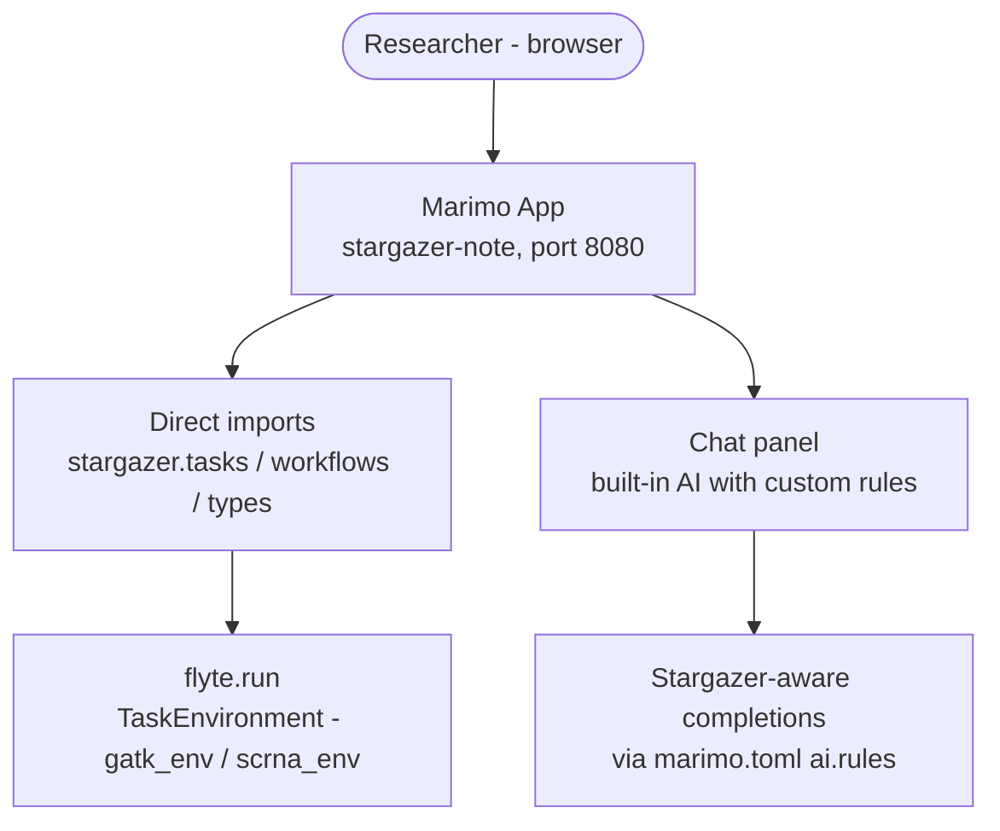
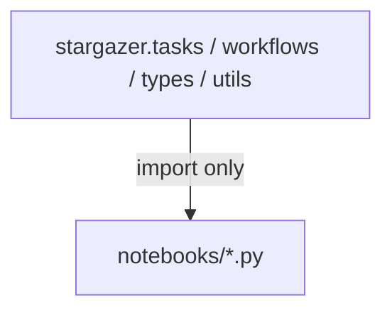

# Notebook App

The `stargazer-note` image is the primary interface for researchers who want to run pipelines, explore data, and visualize results. It launches a [Marimo](https://marimo.io/) notebook in edit mode — the same image serves both local use and hosted production.

```bash
docker run -p 8080:8080 ghcr.io/stargazerbio/stargazer-note:latest
```

For building new tasks and workflows, see the [`chat` image](../guides/contributing.md) instead.

## Architecture



Notebooks import and call Stargazer tasks directly — the same code runs in notebooks and production. The execution context (local vs remote) is determined by the Flyte config, not the code.

## Modes

| Mode | Command | Use case |
|------|---------|----------|
| **Edit** | `stargazer-note` default entrypoint | Local exploration and hosted production |
| **Run** | `marimo run ... --include-code` | Read-only shareable view (Flyte App) |

## Execution Context

Notebooks call `flyte.init_from_config()` at startup. The `.flyte/config.yaml` determines whether tasks run locally or on a remote cluster. Researchers explore locally, then promote to production by pointing at a remote Flyte instance — no code changes needed.

## Boundary Rule

**Notebooks never export, only import.** The dependency graph is strictly one-directional:



Notebooks are free to experiment, prototype, and visualize — but they are never a dependency of production code. This keeps the module graph clean and means notebook changes cannot break tasks or workflows.

## Adding Notebooks

1. Create a new `.py` file in `src/stargazer/notebooks/`
2. Use the standard Marimo format: `import marimo`, `app = marimo.App()`, `@app.cell`
3. Import from `stargazer` public APIs (tasks, workflows, types, utils)
4. To include in the deployed app, update the `include` list in `stargazer.config.note_env` (the `AppEnvironment` that backs the notebook server) — it pulls the listed paths into the code bundle that `fserve` mounts at runtime. To change which notebook the entrypoint opens, edit the `note` target's `ENTRYPOINT` in the project `Dockerfile` (and `note_env.args` in `config.py` to keep hosted deploys aligned).

## Packaging Boundary

In production, stargazer is installed as a proper package (not editable) via the AppEnvironment's `with_uv_project(pyproject_file=..., project_install_mode="install_project")`, which resolves all dependencies from `uv.lock` and bakes the stargazer package into the image. This means:

- **Package tasks** in `src/stargazer/tasks/` are available in production notebooks automatically.
- **Notebook-defined tasks** work locally (editable install) but are not available in production until promoted into the package.

This is a feature — it prevents untested code from silently ending up in production. The boundary is blurred in local dev (editable install) so researchers can experiment freely.

## Task Authoring and Promotion

Researchers define tasks directly in notebook cells using proper Flyte conventions — `@gatk_env.task`, asset types, async signatures. These are real tasks that run against real data in the notebook.

The promotion pathway:

1. **Author** in a notebook cell — use proper decorators, structured I/O, async patterns. The task works in the notebook as-is.
2. **Promote** — mechanical extraction: strip the `@app.cell` wrapper, move the function into the right `src/stargazer/tasks/` subdirectory, generate a skeleton test.
3. **Review** — a code-review agent picks up the PR and suggests changes to fit project conventions (docstrings, naming, test coverage). Convention enforcement happens at review time, not authoring time.

Researchers don't need to know every project convention upfront. They write a working task. The promotion step does the mechanical extraction, and the PR review layer adds the project polish.

Once a promoted task needs refinement beyond what the review agent suggests, the researcher either puts on a dev hat (full environment) or hands off to a dev contributor. The notebook is the prototyping surface, not a second editing environment for production code.

### Roadmap: `stargazer promote-task`

A CLI command for the mechanical extraction step:

```
stargazer promote-task notebooks/scratch/experiment.py::cell_name --to tasks/deepvariant.py
```

This would:
- Extract the cell function body using `ast` (marimo files are valid Python)
- Drop it into the target module with the existing decorator and types intact
- Generate a skeleton test in `tests/unit/`
- Open a PR via the server-side GitHub flow

Not yet implemented — waiting for real usage patterns to inform the exact UX.

## AI Chat

Marimo's built-in chat panel is configured with stargazer authoring conventions via `marimo.toml` `[ai] rules`. This gives every researcher a stargazer-aware AI assistant for completions and chat — covering task patterns, asset types, workflow composition, and project structure — without any custom backend.

## Future: MCP Server Integration

Marimo does not yet support custom MCP server configuration (only built-in presets). When this ships upstream, the stargazer MCP server can be wired into marimo's chat panel as a one-line config change, giving the AI assistant direct access to `list_tasks`, `run_task`, `query_files`, and other stargazer tools. Until then, the MCP server is available to developers via coding tools (Claude Code, Cursor, etc.).
