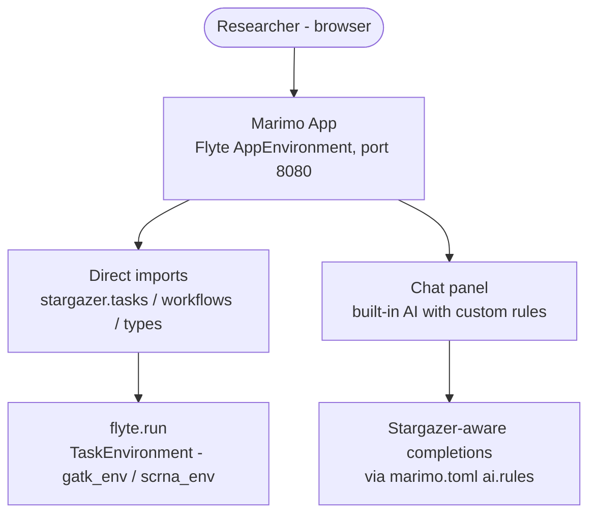
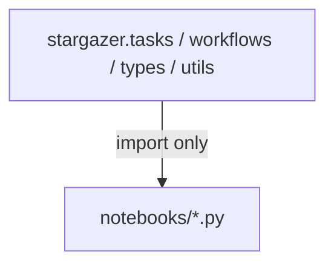

# Notebook App

Stargazer deploys [Marimo](https://marimo.io/) notebooks as a Flyte App, providing researchers with an interactive, Python-native interface for exploring data, running tasks, and visualizing results.

## Architecture



Notebooks import and call Stargazer tasks directly — the same code runs in notebooks and production. The execution context (local vs remote) is determined by the Flyte config, not the code.

## Modes

| Mode | Command | Use case |
|------|---------|----------|
| **Edit** | `marimo edit src/stargazer/notebooks/getting_started.py` | Local development and exploration |
| **Run** | `marimo run ... --include-code` | Deployed Flyte App (read-only, shareable) |

## Execution Context

Notebooks call `flyte.init_from_config()` at startup. The `.flyte/config.yaml` determines whether tasks run locally or on a remote cluster. Researchers explore locally, then promote to production by pointing at a remote Flyte instance — no code changes needed.

## Boundary Rule

**Notebooks never export, only import.** The dependency graph is strictly one-directional:



Notebooks are free to experiment, prototype, and visualize — but they are never a dependency of production code. This keeps the module graph clean and means notebook changes cannot break tasks or workflows.

## Adding Notebooks

1. Create a new `.py` file in `src/stargazer/notebooks/`
2. Use the standard Marimo format: `import marimo`, `app = marimo.App()`, `@app.cell`
3. Import from `stargazer` public APIs (tasks, workflows, types, utils)
4. To include in the deployed app, update the `command` in `stargazer.app.marimo_env` or use `create_asgi_app().with_dynamic_directory()` for multi-notebook serving

## Notebook Authoring and Task Promotion

Researchers will often prototype new task logic in notebook cells before it becomes a production task. The intended workflow:

1. **Prototype** in `notebooks/scratch/` — iterate on parameters, visualize intermediate results, validate against known outputs
2. **Promote** the working logic into a proper module in `tasks/` with types, docstrings, and tests
3. **Replace** the notebook prototype cell with an import from the new task module

Marimo's `.py` format makes this natural — cells are plain Python functions, so extracting logic into a module is straightforward copy-paste. Step 2 is currently manual.

### Roadmap: `stargazer promote-task`

A future CLI command to reduce friction in the prototype-to-production loop:

```
stargazer promote-task notebooks/scratch/experiment.py::cell_name --to tasks/deepvariant.py
```

This would:
- Extract the cell function body using `ast` (marimo files are valid Python)
- Scaffold a task module with the correct Flyte decorator, type annotations, and docstring template
- Generate a skeleton test in `tests/unit/`
- Leave a note in the source notebook cell pointing to the new module

Not yet implemented — waiting for real usage patterns to inform the exact UX.

## AI Chat

Marimo's built-in chat panel is configured with stargazer authoring conventions via `marimo.toml` `[ai] rules`. This gives every researcher a stargazer-aware AI assistant for completions and chat — covering task patterns, asset types, workflow composition, and project structure — without any custom backend.

## Future: MCP Server Integration

Marimo does not yet support custom MCP server configuration (only built-in presets). When this ships upstream, the stargazer MCP server can be wired into marimo's chat panel as a one-line config change, giving the AI assistant direct access to `list_tasks`, `run_task`, `query_files`, and other stargazer tools. Until then, the MCP server is available to developers via coding tools (Claude Code, Cursor, etc.).
