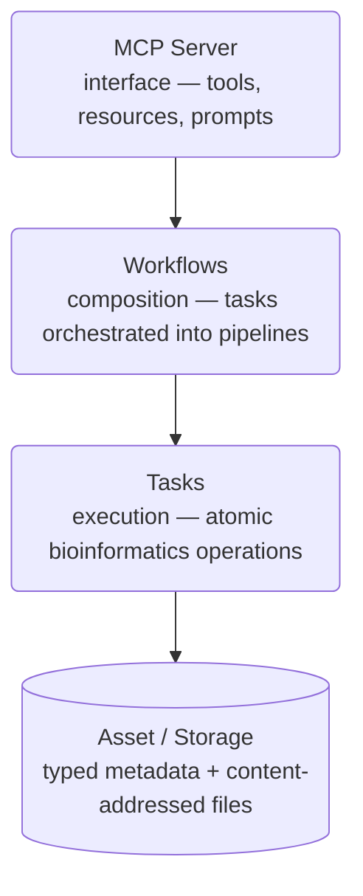

# Architecture Overview

Stargazer is organized around four layers:

## Asset System

Every file is an `Asset` — a dataclass with a content identifier, optional local path, and flat keyvalue metadata. Subclasses like `Reference`, `Alignment`, and `Variants` add typed fields with automatic coercion to/from the string-valued keyvalue store.

Assets link to related files (e.g., an index to its primary file) via the companion pattern: `{asset_key}_cid` keyvalues. Calling `fetch()` on an asset downloads it and all its companions.

See [Types](types.md) for the full asset catalog.

## Tasks

Tasks are async Flyte v2 functions that receive typed assets, fetch them, run tools, and produce new assets. Each task does one thing — align reads, sort a BAM, mark duplicates.

See [Tasks](tasks.md) for the task model.

## Workflows

Workflows are tasks that call other tasks. They accept scalar parameters, call `assemble()` to query for assets, and orchestrate the pipeline. Parallel execution uses `asyncio.gather`.

See [Workflows](workflows.md) for the workflow model.

## MCP Server

The server exposes two execution paths:

- **`run_task`** — ad-hoc experimentation; the server assembles assets from filters
- **`run_workflow`** — reproducible pipelines; workflows handle their own assembly

See [MCP Server](mcp-server.md) for the full server specification.

## Interface

Stargazer is accessed through two end-user Docker images:

- **`stargazer-note`** — Marimo notebook in edit mode, for running pipelines and exploring data. See [Notebook App](notebook.md).
- **`stargazer-chat`** — pre-wired Claude Code + OpenCode harness driving the Stargazer MCP server. End-user image, not a contributor dev shell.

Both include the MCP server over stdio. Any MCP client connects to `stargazer serve`. Tasks and workflows can also be managed directly via the [Flyte CLI](cli.md#flyte-cli). Source contributors install natively — see [Contributing](../guides/contributing.md).

## Configuration

Storage backend is controlled by `PINATA_JWT` and `PINATA_VISIBILITY`. See [Configuration](configuration.md).
