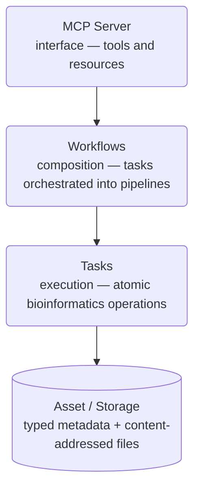

# Architecture Overview

Stargazer is organized around four layers:

```mermaid
flowchart TD
    MCP("MCP Server\ninterface — tools and resources")
    WF("Workflows\ncomposition — tasks orchestrated into pipelines")
    T("Tasks\nexecution — atomic bioinformatics operations")
    A[("Asset / Storage\ntyped metadata + content-addressed files")]

    MCP --> WF --> T --> A
```

## Asset System

Every file is an `Asset` — a dataclass with a content identifier, where its stored bytes live (a `flyte.io.File`), and typed metadata stored as flat keyvalues. Subclasses like `Reference`, `Alignment`, and `Variants` add typed fields with automatic coercion to/from the string-valued keyvalue store.

Assets link to related files (e.g., an index to its primary file) via the companion pattern: `{asset_key}_cid` keyvalues. Calling `fetch()` on an asset downloads it and all its companions.

See [Types](types.md) for the full asset catalog.

## Tasks

Tasks are async Flyte v2 functions that receive typed assets, fetch them, run tools, and produce new assets. Each task does one thing — align reads, sort a BAM, mark duplicates.

See [Tasks](tasks.md) for the task model.

## Workflows

Workflows are tasks that call other tasks. They accept scalar parameters, call `assemble()` to query for assets, and orchestrate the pipeline. Parallel execution uses `asyncio.gather`.

See [Workflows](workflows.md) for the workflow model.

## MCP Server

The server exposes two execution paths:

- **`run_task`** — ad-hoc experimentation; the server assembles assets from filters
- **`run_workflow`** — reproducible pipelines; workflows handle their own assembly

See [MCP Server](mcp-server.md) for the full server specification.

## Interface

The marimo notebook is the primary user surface. The hosted app serves a per-user dashboard of four notebook types — Tutorials, Workflows, Workspace, Snapshots — and notebooks are also where new tasks are prototyped before being promoted into the SDK. See [Notebooks](notebook.md) for the taxonomy, user archetypes, and promotion paths, and [App](app.md) for the hosting machinery.

For local use, the repository's Dockerfile builds two end-user Docker images:

- **`stargazer-note`** — Marimo notebook in edit mode, for running pipelines and exploring data locally (the hosted app uses a separate, richer image — see [App → Images](app.md#images)).
- **`stargazer-chat`** — Claude Code + OpenCode with the MCP server installed and configured. End-user image, not a contributor dev shell.

The MCP server runs over stdio, in the chat image or from a source install with the `mcp` extra; any MCP client connects to `stargazer`. Tasks and workflows can also be managed directly via the [Flyte CLI](cli.md#flyte-cli). Source contributors install natively — see [Contributing](../guides/contributing.md).

## Configuration

Storage locations are set by `STARGAZER_STORE_ROOT` and `STARGAZER_INDEX_URL`; `PINATA_JWT` turns on the public tier. See [Configuration](configuration.md).
