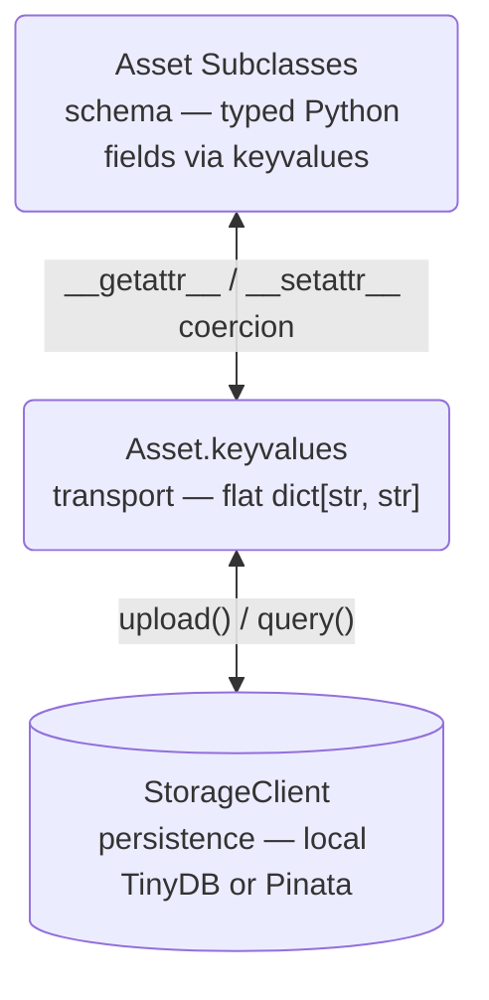

# Types and Asset System

## Design Goals

Every file in Stargazer carries structured keyvalue metadata that describes its role, enabling:

- **Consistency**: All tools produce and consume files through the same metadata contract
- **Extensibility**: New asset types and metadata fields can be added without breaking existing code
- **Queryability**: Files can be discovered and filtered by metadata without path conventions
- **Companion linking**: Related files (e.g. index + primary) are linked by CID references

## Architecture



There is no separate "storage primitive" layer. `Asset` is both the typed schema and the storage identity.

## Asset: The Base Class

`Asset` (`types/asset.py`) is a single dataclass for all typed file assets. Every file in the system is an Asset instance.

| Field | Type | Purpose |
|-------|------|---------|
| `cid` | `str` | Content identifier (IPFS or local hash) |
| `path` | `Path \| None` | Local filesystem path (set after download/upload) |
| `keyvalues` | `dict[str, str]` | Flat metadata for querying and routing |

### Subclass Declaration

Subclasses declare `_asset_key` and standard typed dataclass annotations:

```python
@dataclass
class Alignment(Asset):
    _asset_key: ClassVar[str] = "alignment"
    sample_id: str = ""
    duplicates_marked: bool = False
    bqsr_applied: bool = False
```

`__init_subclass__` automatically derives `_field_types` (non-`str` fields) and `_field_defaults` (all defaults) from the annotations — these are never declared manually. Subclasses also auto-register in `Asset._registry`, which maps `_asset_key` strings to their class.

### Keyvalue Coercion

`__getattr__` and `__setattr__` transparently read/write `keyvalues` with type coercion:

- `bool`: stored as `"true"` / `"false"`, returned as Python `bool`
- `int`: stored as string, returned as Python `int`
- `list`: stored as comma-separated string, returned as Python `list[str]`
- `str`: no coercion needed

Accessing a missing key returns the default derived from the annotation, or `False` for bools, or `None`.

### Core Methods

- `fetch()` — downloads self, then queries for companions via `{_asset_key}_cid = self.cid` and downloads those too
- `update(path, **kwargs)` — sets keyvalues from kwargs, sets path, uploads to storage
- `to_dict()` / `from_dict()` — JSON serialization

## Asset Subclass Catalog

See the [Catalog](../reference/catalog.md#asset-types) for a complete list of registered asset types.

## Companion Pattern

Assets link to related files via `{asset_key}_cid` keyvalues. When `fetch()` is called on an asset:

1. Downloads the asset itself
2. Queries for assets where `{_asset_key}_cid` equals this asset's CID
3. Downloads all matching companions

Example: `Reference(cid="Qmref").fetch()` also finds and downloads any `ReferenceIndex` with `reference_cid="Qmref"`.

## Assembly

`assemble(**filters)` is a module-level async function in `types/asset.py`. It queries storage with keyvalue filters, deduplicates by CID, and returns a flat `list[Asset]` of specialized subclass instances.

The `asset` filter key accepts a string or list of strings. List-valued filters produce cartesian product queries via `utils/query.py`.

Workflows filter results with `isinstance`:

```python
assets = await assemble(build="GRCh38", asset="reference")
ref = next(a for a in assets if isinstance(a, Reference))
```

## Specialization

`specialize(asset)` in `types/__init__.py` converts a base `Asset` to its registered subclass by looking up `keyvalues["asset"]` in `Asset._registry`. Returns the original instance if no match.

## Storage Layer

`utils/local_storage.py` defines `LocalStorageClient` with four methods: `upload()`, `download()`, `query()`, `delete()`. The module-level `default_client` is resolved at import time based on environment:

- No JWT: `LocalStorageClient` with TinyDB for metadata, public IPFS gateway for cache misses
- `PINATA_JWT` set: `LocalStorageClient` + `PinataClient` remote for authenticated operations

The two modes are explicit: with a JWT, Pinata owns metadata and TinyDB is not involved. Without a JWT, TinyDB is the source of truth. Upload, query, and delete each go to one backend, never both.

Tasks never call storage directly. All storage interaction flows through `Asset.fetch()` and `Asset.update()`.
