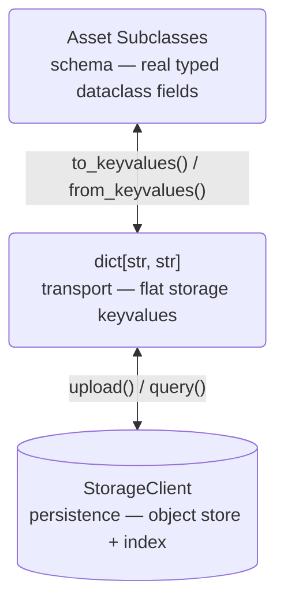

# Types and Asset System

## Design Goals

Every file in Stargazer carries structured keyvalue metadata that describes its role, enabling:

- **Consistency**: All tools produce and consume files through the same metadata contract
- **Extensibility**: New asset types and metadata fields can be added without breaking existing code
- **Queryability**: Files can be discovered and filtered by metadata without path conventions
- **Companion linking**: Related files (e.g. index + primary) are linked by CID references

## Architecture

```mermaid
flowchart TD
    SC("Asset Subclasses\nschema — real typed dataclass fields")
    KV("dict[str, str]\ntransport — flat storage keyvalues")
    ST[("StorageClient\npersistence — object store + index")]

    SC <-->|"to_keyvalues() / from_keyvalues()"| KV
    KV <-->|"upload() / query()"| ST
```

There is no separate "storage primitive" layer. `Asset` is both the typed schema and the storage identity. Typed fields are ordinary dataclass attributes; the flat `dict[str, str]` exists only at the storage boundary, produced and consumed by `to_keyvalues()` / `from_keyvalues()`.

## Asset: The Base Class

`Asset` (`assets/asset.py`) is a single dataclass for all typed file assets. Every file in the system is an Asset instance.

| Field | Type | Purpose |
|-------|------|---------|
| `cid` | `str` | IPFS CID of the file, computed locally from its bytes |
| `path` | `flyte.io.File \| None` | Where the stored file lives (set by `update()`); assigning a local `Path` wraps it in a File |
| `keyvalues` | `dict[str, str]` | Free-form metadata — **bare `Asset` only** (see Catchall below) |

### Subclass Declaration

Subclasses declare `_asset_key` — a unique string identifying the asset kind — plus ordinary typed dataclass fields with defaults (e.g. `Alignment` declares `sample_id`, `duplicates_marked`, `bqsr_applied`). See [Writing a Task](../guides/writing-a-task.md) for a worked declaration. Subclasses auto-register in `Asset._registry` (via `__init_subclass__`), which maps `_asset_key` strings to their class. Registration is import-driven and per-process: a class defined in user code registers the moment its module imports, so `assemble()` returns it in any process that imports it.

`__setattr__` **enforces** the declared schema on typed subclasses — assigning a field the dataclass doesn't declare raises `AttributeError`, catching metadata typos at write time. On a bare `Asset` (no `_asset_key`) it passes through.

### Serialization

`to_keyvalues()` / `from_keyvalues()` convert between typed fields and the flat `dict[str, str]` storage carries:

- `str` fields pass through unchanged.
- All other types round-trip via `json.dumps` / `json.loads` (`bool` → `"true"`, `int` → `"12"`, `list` → JSON array).

`from_keyvalues()` raises on a non-`str` value that doesn't parse; callers that must tolerate malformed records catch it (see [Specialization](#specialization)).

### Catchall: bare `Asset`

A bare `Asset` (no `_asset_key`) carries a free-form `keyvalues` dict, serialized **verbatim** (the `asset` key lives inside it). This is the escape hatch for uploading a file whose asset key has no registered class yet — only the `asset` key is required, no field schema is enforced. When a user later defines a matching `Asset` subclass, those records type-promote on the next query. Typed subclasses ignore the inherited `keyvalues` field entirely; it's part of `_BASE_FIELDS`.

### Validation: `build_asset()`

`build_asset(keyvalues)` (`assets/__init__.py`) is the single validation choke point shared by the MCP server (`upload_file`, `update_file`) and the admin asset page (`/assets/sign` uploads and `/assets/update` metadata edits). It requires an `asset` key, rejects reserved `_`-prefixed keys (stamped automatically — see Ownership), validates registered keys strictly against their dataclass, and builds a bare `Asset` for unregistered keys. One place decides typed-vs-generic so the page and the SDK never drift.

### Ownership (`_owner`)

`_owner` is a reserved keyvalue stamped automatically for attribution — never typed by users (`build_asset()` rejects `_*` keys). The storage client stamps it from `STARGAZER_OWNER` on every index row it writes (`upload()` and `update_metadata()`), and `PinataClient` on public uploads; the env wins over any stale value, and with it unset nothing is stamped. The asset page stamps the signed-in user. It records who made a record; it grants or denies nothing, and on Pinata's public network anyone holding the key can edit or delete any record. Hosted-deployment plumbing is in [App → Asset Manager](app.md#asset-manager).

### Core Methods

- `fetch()` — downloads self, then queries for companions via `{_asset_key}_cid = self.cid` and downloads those into the same directory; returns the local path
- `update(path, **kwargs)` — sets the given attributes, stores the file, and sets `cid` and `path`
- `to_dict()` / `from_dict()` — JSON serialization

## Asset Subclass Catalog

See the [Catalog](../reference/catalog.md#asset-types) for a complete list of registered asset types.

## Companion Pattern

Assets link to related files via `{asset_key}_cid` keyvalues. When `fetch()` is called on an asset:

1. Downloads the asset itself
2. Queries for assets where `{_asset_key}_cid` equals this asset's CID
3. Downloads all matching companions into the same directory, so tools find an index next to its file
4. Returns the asset's local path

Example: `Reference(cid="bafk…").fetch()` also finds and downloads any `ReferenceIndex` with `reference_cid="bafk…"`. Any asset recording that key counts, not only indexes: an `Alignment` records `reference_cid` too, so fetching a reference also downloads every alignment made against it. A mate isn't a companion — reads link each other through `mate_cid`, which no asset key produces.

## Assembly

`assemble(**filters)` is a module-level async function in `assets/asset.py`. It queries storage with keyvalue filters, deduplicates by CID, and returns a flat `list[Asset]` of specialized subclass instances.

Every filter must match exactly. A list value matches any of its entries, in a single query (the `asset` key accepts a list too).

Workflows filter the returned list with `isinstance` to pick out the types they need — see [Writing a Workflow](../guides/writing-a-workflow.md).

## Specialization

`specialize(record)` in `assets/__init__.py` converts a raw storage record to its registered subclass by looking up `keyvalues["asset"]` in `Asset._registry`. It is **graceful at query time** (the mirror of `build_asset()` being strict at write time): an unregistered key, or a record whose values don't parse against the registered class, falls back to a bare `Asset` carrying the keyvalues verbatim rather than raising — so one malformed legacy record can't crash a whole `assemble()`.

## Storage Layer

`utils/storage.py` defines `StorageClient`, the one storage interface: `upload()`, `download()`, `query()`, `get()`, `delete()` and `update_metadata()`. The module-level `default_client` is built lazily from the environment, so it sees credentials Flyte injects just before a task runs.

- **Bytes** go to the object store at `<store root>/users/<owner>/assets/<cid>/<name>`.
- **Metadata** goes to the index (`utils/index.py`), one row per CID; on Union the user's dashboard owns it.
- **Public data** joins queries from Pinata's public network when `PINATA_JWT` is set.
- **The cache** at `<STARGAZER_LOCAL>/<cid>/<name>` sits in front of downloads.

The CID comes from `utils/cid.py`, which builds the same UnixFS DAG Pinata does, so identity never depends on where a file is stored. Locations and settings are in [Configuration](configuration.md).

Tasks never call storage directly. All storage interaction flows through `Asset.fetch()`, `Asset.update()` and `assemble()`.
